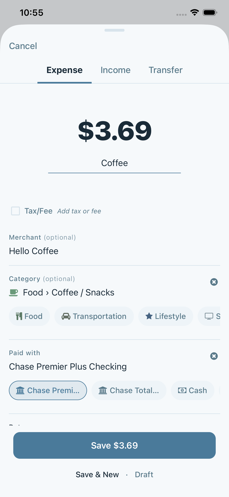

# MyMoneyTracker

> A privacy-first personal finance app with offline-first architecture, built with React Native and Clean Architecture principles.

<p align="center">
  <!-- SCREENSHOT: App icon or hero image showing 3 screens side by side (Dashboard, Add Transaction, Transactions List) -->
  
</p>

---

## Why I Built This

Most finance apps require cloud accounts and share data with third parties. I wanted a **privacy-first** solution that:

- Keeps all financial data **on-device only** (SQLite)
- Works **offline** without any server dependency
- Provides **real insights** into spending patterns, not just lists of transactions

This project also served as a deep dive into **Clean Architecture** in a React Native context, with a focus on testability and maintainability.

---

## Key Features

### Dashboard with Multiple Views

Track your finances from different perspectives - monthly calendar view, yearly trends, or all-time overview.

<p align="center">
  <!-- SCREENSHOT: Dashboard Monthly view showing calendar heatmap + category breakdown -->
  
  &nbsp;&nbsp;
  <!-- SCREENSHOT: Dashboard Yearly view showing 12-month bar chart -->
  
  &nbsp;&nbsp;
  <!-- SCREENSHOT: Dashboard All-time view showing cumulative net chart -->
  
</p>

**Monthly View** - Calendar heatmap showing daily spending patterns with category breakdowns
**Yearly View** - Month-by-month cash flow comparison with income vs expense bars
**All-Time View** - Cumulative net worth tracking over your entire history

---

### Quick Transaction Entry

Add expenses, income, or transfers in seconds with smart category suggestions and quick chips.

<p align="center">
  <!-- SCREENSHOT: Add Transaction screen with keypad visible -->
  
  &nbsp;&nbsp;
  <!-- SCREENSHOT: Category selection modal -->
  
  &nbsp;&nbsp;
  <!-- SCREENSHOT: Quick chips row -->
  
</p>

- **20+ Categories** with subcategories (Food > Groceries, Food > Eating Out, etc.)
- **Quick Chips** - One-tap entry for frequent transactions
- **Multiple Accounts** - Checking, savings, credit cards, cash
- **Drafts** - Save incomplete transactions and finish later

---

### Spending Insights

Understand your spending patterns with visual analytics and smart alerts.

<p align="center">
  <!-- SCREENSHOT: Insights view showing spending patterns -->
  
  &nbsp;&nbsp;
  <!-- SCREENSHOT: Budget progress bar with alert -->
  
</p>

- **Daily Spending Patterns** - Which days you spend the most
- **Category Trends** - Month-over-month comparison by category
- **Budget Alerts** - Get notified when approaching spending limits

---

### Price Tracker

Track prices of groceries and household items over time to find the best deals.

<p align="center">
  <!-- SCREENSHOT: Price Tracker list view -->
  
  &nbsp;&nbsp;
  <!-- SCREENSHOT: Price history chart for an item -->
  
</p>

---

## Technical Highlights

### Clean Architecture

```
┌─────────────────────────────────────────┐
│           UI Layer (Screens)            │
├─────────────────────────────────────────┤
│         Features (Hooks, Components)    │
├─────────────────────────────────────────┤
│      Domain (Pure Types, Models)        │  ← No external dependencies
├─────────────────────────────────────────┤
│   Infrastructure (SQLite, Repositories) │
└─────────────────────────────────────────┘
```

- **Domain layer is 100% pure** - Zero infrastructure imports
- **Repository pattern** - Swappable data layer
- **Feature-first organization** - Self-contained feature modules

### Comprehensive Testing

| Metric | Value |
|--------|-------|
| Test Suites | 36 |
| Total Tests | 553 |
| Code Coverage | ~78% |
| Unit Tests | Models, Services, Stores, Mappers, Schemas |
| Integration Tests | SQLite repositories with in-memory DB |
| Component Tests | React Native components |
| E2E Tests | Maestro mobile automation |

### Offline-First Design

- **SQLite database** with 23 migrations
- **No cloud dependency** - Works without internet
- **Data stays on device** - Complete privacy

---

## Tech Stack

| Category | Technology |
|----------|------------|
| Framework | React Native + Expo SDK 54 |
| UI | Tamagui Design System |
| Database | SQLite (expo-sqlite) |
| State | Zustand |
| Validation | Zod (runtime type safety) |
| Navigation | Expo Router (file-based) |
| Testing | Jest, Testing Library, Maestro |

---

## Project Structure

```
src/
├── app/                    # Expo Router screens
├── core/
│   ├── domain/             # Pure types, models, schemas (NO external deps)
│   └── services/           # Business logic
├── features/
│   ├── dashboard/          # Monthly, Yearly, All-time, Insights, Accounts
│   ├── transactions/       # Add, Edit, List transactions
│   └── price-tracker/      # Price tracking
├── infrastructure/
│   ├── db/                 # SQLite, migrations
│   ├── repositories/       # Data access layer
│   └── mappers/            # DB ↔ Domain conversion
└── shared/                 # Reusable components, hooks, theme
```

---

## Documentation

For detailed technical documentation:

- [Development Guide](docs/guides/development.md) - Setup and commands
- [Architecture](docs/architecture/overview.md) - Technical deep dive
- [Testing Guide](docs/guides/testing.md) - Test patterns and coverage

---

## Screenshots Checklist

> For adding screenshots later:

| Screenshot | File | Description |
|------------|------|-------------|
| Hero | `hero.png` | 3 screens side by side (Dashboard, Add, Transactions) |
| Dashboard Monthly | `dashboard-monthly.png` | Calendar heatmap + categories |
| Dashboard Yearly | `dashboard-yearly.png` | 12-month bar chart |
| Dashboard All | `dashboard-all.png` | Cumulative net chart |
| Add Transaction | `add-transaction.png` | Keypad + amount entry |
| Category Picker | `category-picker.png` | Category selection modal |
| Quick Chips | `quick-chips.png` | Quick chips row |
| Insights | `insights.png` | Spending patterns view |
| Budget Alert | `budget-alert.png` | Budget progress with alert |
| Price Tracker | `price-tracker.png` | Item list view |
| Price History | `price-history.png` | Price chart for item |

Place screenshots in `assets/screenshots/` folder.

---

## License

Private project - All rights reserved.
