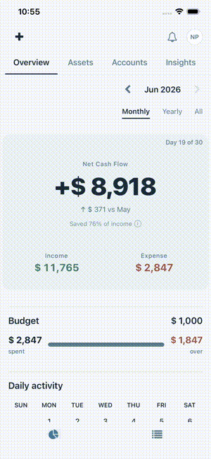
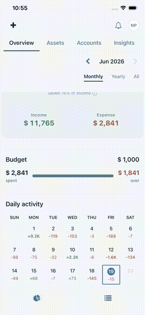
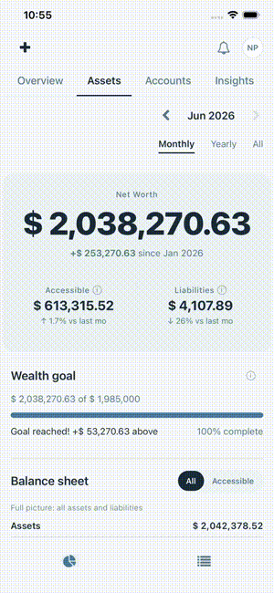

# MyMoneyTracker

**A privacy-first personal finance app built with React Native & Clean Architecture.**

Track spending like a paper journal — no bank sync, no cloud, everything on-device.

<!-- <p align="center">
  
  
  
  
</p> -->

---

## Demo

<table align="center">
  <tr>
    <td align="center"></td>
    <td align="center"></td>
    <td align="center"></td>
  </tr>
  <tr>
    <td align="center"><b>Dashboard</b></td>
    <td align="center"><b>Add Transaction</b></td>
    <td align="center"><b>Net Worth</b></td>
  </tr>
</table>

---

## Features

| Feature         | Description                                   |
| --------------- | --------------------------------------------- |
| **Dashboard**   | Monthly, yearly, and all-time spending views  |
| **Calendar**    | Visual spending patterns with daily breakdown |
| **Categories**  | 20+ categories with subcategories             |
| **Accounts**    | Cash, checking, savings, credit cards         |
| **Net Worth**   | Track assets, liabilities, balance sheet      |
| **Quick Entry** | Customizable chips for frequent transactions  |
| **Drafts**      | Save incomplete transactions, finish later    |
| **Dark Mode**   | Full dark theme support                       |

---

## Tech Stack

| Layer            | Technology                 |
| ---------------- | -------------------------- |
| **Framework**    | React Native / Expo SDK 54 |
| **Navigation**   | Expo Router (file-based)   |
| **Database**     | SQLite (expo-sqlite)       |
| **State**        | Zustand                    |
| **Validation**   | Zod                        |
| **Architecture** | Clean Architecture         |

---

## Architecture

```
src/
├── app/                    # Expo Router screens
├── core/
│   ├── domain/             # Pure types, models (no dependencies)
│   └── services/           # Business logic
├── features/               # Feature modules
│   ├── dashboard/          # Monthly, Yearly, All-time views
│   ├── transactions/       # Add, Edit, List
│   └── assets/             # Net worth tracking
├── infrastructure/
│   ├── db/                 # SQLite, migrations
│   ├── repositories/       # Data access layer
│   └── mappers/            # DB ↔ Domain conversion
└── shared/                 # Components, hooks, theme tokens
```

**Key Principles:**

- Domain layer is 100% pure — zero infrastructure imports
- Repository pattern for swappable data layer
- Feature-first organization with co-located hooks
- Design system with semantic tokens

---

## Privacy by Design

|                  |         |
| ---------------- | ------- |
| Bank sync        | ❌ None |
| Cloud storage    | ❌ None |
| Account creation | ❌ None |
| Analytics        | ❌ None |
| Data collection  | ❌ None |

**Everything stays on your device.**

---

## Quick Start

```bash
git clone https://github.com/nicoleekpark/mymoneytracker.git
cd mymoneytracker
npm install
npx expo start
```

---

## License

MIT License — see [LICENSE](LICENSE) for details.

---

<p align="center">
  <strong>Your money. Your data. Your awareness.</strong>
</p>
