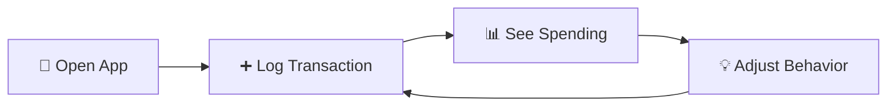

# HoH Finance Tracker — Project Overview

> **One-Page Introduction**: Everything you need to know in 5 minutes

---

## What is HoH Finance Tracker?

**A cross-platform personal finance app for manual, intentional money tracking.**

Tha app is built with Expo/React Native and Tamagui. It supports iOS, Android, and web. The app uses expo-sqlite for local data persistence with a custom migration system.

Unlike Mint or YNAB, HoH doesn't sync with your bank. Instead, you **consciously log every transaction**, building financial awareness through active participation.

```
┌─────────────────────────────────────┐
│  "I want to know where my money     │
│   goes without linking my bank      │
│   account."                         │
└─────────────────────────────────────┘
```

---

## The Problem

💸 **Passive tracking doesn't build awareness**
- Automatic bank sync creates observers, not participants
- Users don't remember what they spent on

🔒 **Bank linking feels risky**
- Users don't trust giving apps their credentials
- Privacy concerns with financial data in the cloud

📊 **Complex tools overwhelm**
- Too many features, steep learning curve
- Users want clarity, not accounting software

---

## Our Solution

### Core Philosophy

1. **Offline-First**: All data stays on your device (v1)
2. **Manual Entry**: Logging transactions builds awareness
3. **Zero Friction**: No signup, no email, no authentication
4. **Visual Clarity**: Google Calendar-inspired daily cash flow

### How It Works



**The Loop**:
1. Open app → 2. Log transaction (< 30 sec) → 3. See visual patterns → 4. Adjust spending

---

## Key Features

### v1 (MVP - In Development)

| Feature | Description |
|---------|-------------|
| **📅 Daily Cash Flow Calendar** | See spending intensity by day (Google Calendar-style) |
| **💰 Budget Tracking** | Set monthly budget, track progress, see crossing date |
| **🍕 Category Breakdown** | Donut chart showing where money goes |
| **📝 Transaction Log** | Search, filter, view transaction history |
| **🔄 Account Management** | Track checking, savings, credit cards, cash |
| **📱 Cross-Platform** | iOS, Android, Web (functional parity) |

### v2 (Future Vision)

| Feature | Description |
|---------|-------------|
| **👨‍👩‍👧‍👦 Family Sharing** | Multi-user with granular permissions (teach kids financial habits) |
| **🤖 AI Insights** | Pattern recognition, fixed cost detection, budget recommendations |
| **☁️ Cloud Sync** | Optional sync across devices |
| **🔁 Recurring Transactions** | Auto-create rent, subscriptions, bills |
| **✏️ Transaction Editing** | Edit past transactions with audit trail |

---

## Who It's For

### Primary Users

**The Conscious Spender**
- Wants clarity over spending
- Comfortable with manual entry
- Values privacy (no bank linking)
- Needs something that works offline

**Jobs-to-be-Done**:
- "I want to see where my money goes each month"
- "I want to stick to a budget without complex tracking"
- "I want to catch overspending early"

### Future Users (v2)

**The Family Organizer**
- Parent teaching kids financial responsibility
- Wants shared visibility without invading privacy

**The Co-Owner**
- Airbnb co-hosts tracking income/expenses
- Small business partners

---

## Tech Stack

### Platforms
- **iOS**: Primary platform
- **Android**: Functional parity (v2)
- **Web**: Mobile-first, functional parity (v2)

### Frontend
- **Framework**: Expo (React Native)
- **UI Library**: Tamagui
- **Language**: TypeScript
- **Routing**: Expo Router (file-based)
- **State**: Zustand

### Backend (v1)
- **Database**: expo-sqlite (local only)
- **Architecture**: Clean Architecture with Repository Pattern
- **No cloud**: 100% offline-first

### Backend (v2)
- **API**: Node.js + Express
- **Database**: PostgreSQL (cloud)
- **Sync**: REST + WebSocket
- **Auth**: JWT tokens

---

## Project Structure

```
hoh_finance-tracker/
├── src/
│   ├── app/                 # Expo Router (routing)
│   ├── features/            # Feature modules
│   │   ├── dashboard/       # Main dashboard
│   │   └── transactions/    # Transaction list & add
│   ├── domain/              # Pure business logic
│   │   ├── account/
│   │   ├── category/
│   │   ├── common/
│   │   └── transaction/
│   ├── infrastructure/      # Data access layer
│   │   ├── db/              # SQLite utilities
│   │   ├── repositories/    # Repository implementations
│   │   └── mappers/         # Data transformers
│   ├── shared/              # Reusable components
│   │   ├── components/      # UI components
│   │   ├── layout/          # Layout wrappers
│   │   ├── format/          # Formatters (currency, date)
│   │   ├── hooks/           # React hooks
│   │   └── utils/           # Pure utilities
│   ├── store/               # Global state (Zustand)
│   ├── providers/           # React context providers
│   ├── theme/               # Theme definitions
│   └── config/              # App configuration
└── docs/                    # Documentation (you are here)
```

**Key Principles**:
1. **Feature-first**: If used by one feature → `features/xyz/`
2. **Shared**: If used by multiple features → `shared/`
3. **Domain**: Pure business logic (no React, no I/O) → `domain/`
4. **Infrastructure**: External I/O (DB, API) → `infrastructure/`

See `/CLAUDE.md` for detailed architecture guide.

---

## Design Principles

### Inspiration

- **Google Calendar**: Grid-based daily view, clear temporal navigation
- **Apple Calendar**: Modal patterns for quick entry
- **Mint/YNAB**: Budget visualization, category breakdown
- **iOS Native**: Scroll wheel pickers, gesture-driven

### Visual Language

```
┌─────────────────────────────────────┐
│  Clean · Minimal · Data-Dense       │
│                                     │
│  ✅ Bold typography (800-900)       │
│  ✅ Consistent spacing              │
│  ✅ Color-coded (green/red)         │
│  ✅ Responsive gestures             │
│  ✅ Light/Dark mode                 │
└─────────────────────────────────────┘
```

---

## Development Status

### v1 Progress

| Feature | Status |
|---------|--------|
| Dashboard (Monthly View) | ✅ Complete |
| Dashboard (Year/All View) | 🚧 In Progress |
| Transaction List | ✅ Complete |
| Add Transaction | ✅ Complete |
| Account Management | ✅ Complete |
| Budget Tracking | ✅ Complete |
| Category Breakdown | ✅ Complete |
| Search & Filters | ✅ Complete |
| Web Support | ✅ Complete |

---

## Quick Links

### Documentation

| Document | Purpose |
|----------|---------|
| **[PRD v1](../01_prd/v1.en.md)** | Product requirements for MVP |
| **[PRD v2](../01_prd/v2.en.md)** | Future vision (family, AI) |
| **[Open Questions](../01_prd/open-questions.md)** | Unresolved decisions, ideas |
| **[ADR-0001](../03_decisions/adr-0001-repo-doc-strategy.md)** | Repo and documentation architecture strategy |
| **[ADR-0002](../03_decisions/adr-0002-clean-architecture-adoption.md)** | Architecture refactoring decision |
| **[Changelog](../05_delivery/changelog.md)** | Release history |

### Code References

| File | Purpose |
|------|---------|
| **[/CLAUDE.md](../../../CLAUDE.md)** | Architecture guide for developers |
| **[/src/config/app.config.ts](../../../config/app.config.ts)** | App configuration (budget, categories) |
| **[/src/infrastructure/db/migrations/](../../../infrastructure/db/migrations/)** | Database schema migrations |

### Commands

```bash
# Run on iOS with SQLite support
npm run start:dev:ios

# Create new database migration
npm run db:migration:new <name>

# Export simulator database
npm run db:dev:pull
```

---

## Success Metrics (v1 Goals)

| Metric | Target | Status |
|--------|--------|--------|
| **Transaction Entry Time** | < 30 sec | ✅ Achieved (~20 sec) |
| **7-Day Retention** | 40% | 📊 TBD (post-release) |
| **Budget Card Views** | 70% | 📊 TBD (post-release) |
| **Categorization Rate** | 90%+ | ✅ Achieved (required field) |

---

## Contributing

### For Developers

1. Read **[/CLAUDE.md](../../../CLAUDE.md)** for architecture patterns
2. Follow Clean Architecture rules:
   - Domain layer = pure business logic
   - Infrastructure layer = I/O
   - Features orchestrate domain + infra
3. New entities need: domain interface + infra implementation + mapper
4. Run `npm run db:migration:new <name>` for schema changes

### For Product/Design

1. Read **[PRD v1](../01_prd/v1.en.md)** for current scope
2. Add ideas to **[Open Questions](../01_prd/open-questions.md)**
3. Breaking changes require ADR (see `/03_decisions/`)
4. Design changes update **[Design System](../04_design/design-system.md)**

---

## Roadmap at a Glance

```
2026-01 ──► v1.0 Alpha (Current)
          │  ✅ Dashboard monthly view
          │  ✅ Transaction logging
          │  ✅ Budget tracking
          │
2026-02 ──► v1.0 Beta
          │  🚧 Dashboard year/all views
          │  🚧 Transaction editing
          │  🚧 Data export
          │
2026-03 ──► v1.0 Public Release
          │  🎉 First public launch
          │
2026-04 ──► v2.0 Planning
          │  📋 Family features design
          │  📋 AI insights research
          │
2026-10 ──► v2.0 Public Release
          │  👨‍👩‍👧‍👦 Family sharing
          │  🤖 AI insights
          │  ☁️ Cloud sync (optional)
```

---

## Contact & Support

**Project Status**: Private development (not yet public)

**Documentation Questions**: See `/src/docs/new/HOWTO.md`

**Bug Reports**: TBD (post-release)

---

## License

TBD

---

**Last Updated**: January 29, 2026
**Version**: 1.0-alpha
**Next Review**: End of v1 beta (February 2026)
