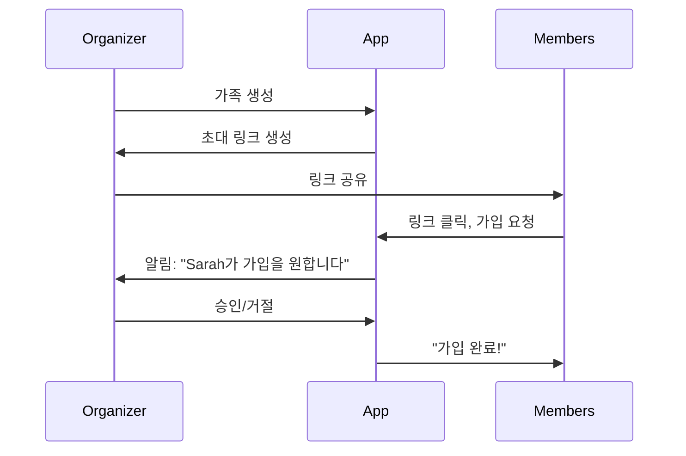

# PRD — v2 (향후 비전)

> **버전**: 2.0 (기획 단계)
> **상태**: 시작 전
> **마지막 업데이트**: 2026년 1월 29일

## 목차

- [개요](#개요)
- [전략적 비전](#전략적-비전)
- [타겟 사용자 (확장)](#타겟-사용자-확장)
- [v2 핵심 기능](#v2-핵심-기능)
- [유저 스토리](#유저-스토리)
- [기술 요구사항](#기술-요구사항)
- [v1에서의 마이그레이션](#v1에서의-마이그레이션)
- [비목표 (Non-Goals)](#비목표-non-goals)
- [성공 지표](#성공-지표)
- [열린 질문들](#열린-질문들)

---

## 개요

v2는 HoH Finance Tracker를 **단일 사용자 오프라인 앱**에서, 가족과 공동 소유자가 함께 쓰는 **공유 재무 시스템**으로 확장하고, **AI 기반 인사이트**를 더한다  
핵심 철학은 그대로다: **수동적이 아닌, 의도적인 기록**  
다만 이제 협업 기능과 지능형 패턴 인식이 추가된다

**주요 추가 사항**:
- 가족 및 다중 사용자 지원 (최대 6명)
- 역할 기반 접근 제어(RBAC)
- AI 기반 지출 인사이트
- 클라우드 동기화(선택)
- 거래 수정 및 감사 추적(audit trails)
- 반복 거래 템플릿

---

## 전략적 비전

### v2에서의 문제

v1은 개인 금융 기록을 해결하지만, 사용자는 새로운 문제를 겪는다
1. **가족**: 부모는 아이들에게 금융 습관을 가르치고 싶다
2. **공동 소유자**: 룸메이트, 비즈니스 파트너, 에어비앤비 공동 호스트는 공유 가시성이 필요하다
3. **패턴 맹점**: 반복되는 과소비를 사용자가 알아차리지 못한다
4. **데이터 증가**: 거래 기록이 쌓일수록 수동 분석이 번거롭다

### v2 솔루션

HoH는 **가족 재무 동반자**가 된다
- **협업 기록**: 여러 사용자, 하나의 단일 진실(SSOT)
- **지능형 인사이트**: 사람이 놓치는 패턴을 AI가 발견
- **프라이버시 제어**: 세밀한 권한 (1Password에서 영감)
- **여전히 오프라인 가능**: 핵심 기능은 인터넷 없이도 동작

### 차별점

| 기능 | Mint/YNAB | HoH v2 |
|---------|-----------|--------|
| 은행 연동 | 필수 | 선택 |
| 다중 사용자 | 없음 | 있음 (가족 중심) |
| 프라이버시 | 클라우드 전용 | 오프라인 우선 + 선택적 동기화 |
| AI 인사이트 | 일반적 | 맥락 기반 + 가족 맥락 인지 |
| 설정 시간 | 20분+ | < 2분 (계정 연결 없음) |

---

## 타겟 사용자 (확장)

### 신규 페르소나: 가족 운영자(Family Organizer)

**인구통계**:
- 나이: 35–50
- 자녀 1–3명 (8–18세)
- 금융 책임감을 가르치고 싶음

**Jobs-to-be-Done**:
1. “아이들이 직접 지출을 기록해서 돈 감각을 배우게 하고 싶다”
2. “개인 거래를 캐묻지 않고도 가족 전체 지출을 보고 싶다”
3. “누가 무엇을 보는지 통제하고 싶다 (예: 아이는 모기지를 못 보게)”
4. “공유 지출(식료품)과 개인 지출을 분리해 추적하고 싶다”

**기존 앱의 문제점**:
- Mint/YNAB는 가족 다중 사용자 지원이 약함/없음
- 공유 계정이 개인/가족 지출을 섞어버림
- 아이 친화적인 금융 교육 도구가 없음

---

### 신규 페르소나: 공동 소유자(Co-Owner)

**인구통계**:
- 나이: 25–40
- 재무 책임을 공유함:
  - 룸메이트(월세/공과금 분담)
  - 에어비앤비 공동 호스트(수입/지출 추적)
  - 소규모 비즈니스 파트너

**Jobs-to-be-Done**:
1. “공동 소유자가 공유 비용에 무엇을 썼는지 보고 싶다”
2. “실제 지출 기반으로 공정하게 비용을 분담하고 싶다”
3. “개인 재정 전체 접근 없이도 투명성을 원한다”

**고충**:
- Venmo/Splitwise는 건별 정산 중심이라 전체 그림이 안 보임
- 공유 엑셀은 오류가 잦음
- ‘믿되 확인’: 침해 없이 가시성 필요

---

## v2 핵심 기능

### 1. 가족 & 다중 사용자 지원

#### 1.1 가족 생성 플로우



**세부 사항:**
- **이메일 불필요** (진입 장벽 낮춤)
- 초대 링크는 7일 후 만료 또는 6명 도달 시 만료 (둘 중 먼저)
- 모든 가입은 Organizer 승인 필수
- 가족당 최대 6명 (v2 제한)
- **유저네임 기반** (게임처럼, 재미 + 저마찰)

#### 1.2 가족 구조
```
Family: "Smith Household"
├── Organizer: John (전체 권한)
├── Co-organizer: Jane (전체 권한, John 제거 불가)
├── Member: Sarah (16세, 제한 권한)
├── Member: Tommy (12세, 보기 전용)
└── Member: Emma (10세, 보기 전용)
```


### 2. 역할 기반 접근 제어 (RBAC)

**영감**: 1Password의 vault 권한 모델

#### 2.1 계정 단위 권한 (Account-Level Permissions)

Organizer는 멤버별로 다음을 제어한다
- **보이는 계정**: “Sarah는 가족 체크 계정은 보되, 부모 투자 계정은 볼 수 없음”
- **보이는 거래**: “Tommy는 자신의 용돈 거래만 볼 수 있음”
- **편집 권한**: “Sarah는 거래 추가는 가능하지만 삭제는 불가”

#### 2.2 권한 매트릭스 (Permission Matrix)

| 기능 | Organizer | Co-organizer | 성인 멤버 | Teen | Child |
|---------|-----------|--------------|--------------|------|-------|
| 거래 추가 | ✅ | ✅ | ✅ | ✅ | ❌ |
| 본인 거래 수정 | ✅ | ✅ | ✅ | ⚠️ (승인 필요) | ❌ |
| 거래 삭제 | ✅ | ✅ | ❌ | ❌ | ❌ |
| 모든 계정 보기 | ✅ | ✅ | 🔒 (설정 가능) | 🔒 | 🔒 |
| 예산 설정 | ✅ | ✅ | ❌ | ❌ | ❌ |
| 멤버 초대 | ✅ | ✅ | ❌ | ❌ | ❌ |
| 권한 변경 | ✅ | ⚠️ (Organizer 제외) | ❌ | ❌ | ❌ |

**범례**:
- ✅ 항상 허용
- ❌ 절대 불가
- 🔒 Organizer가 설정 가능
- ⚠️ 제한적 또는 승인 필요

---

### 3. 가족 뷰 vs 개인 뷰

각 사용자는 **두 가지 대시보드 모드**를 본다

#### 3.1 개인 대시보드

- **내 지출(My Spending)**: 내가 기록했거나 내게 할당된 거래만
- **내 계정(My Accounts)**: 내가 볼 수 있는 권한이 있는 계정만
- **내 예산(My Budget)**: 개인 예산(설정된 경우)

#### 3.2 가족 대시보드

- **가족 지출(Family Spending)**: 모든 멤버의 지출을 집계
- **공유 계정(Shared Accounts)**: 가족 체크, 저축, 신용카드
- **가족 예산(Family Budget)**: Organizer가 설정한 가구 예산
- **멤버별 분해(Member Breakdown)**: 누가 얼마나 썼는지(권한 준수)

**토글**: Personal | Family 빠른 전환 (상단 세그먼트 컨트롤)

**예시**:
```
┌────────────────────────────────────────┐
│  [Personal] [Family]  ← Toggle         │
├────────────────────────────────────────┤
│  Family Spending: $4,200 / $5,000      │
│                                        │
│  By Member:                            │
│  ● John:   $1,800  (43%)               │
│  ● Jane:   $1,400  (33%)               │
│  ● Sarah:    $600  (14%)               │
│  ● Tommy:    $400  (10%)               │
└────────────────────────────────────────┘
```

---


---

### 4. AI 기반 인사이트 (AI-Powered Insights)

**필수**: 사용자 옵트인, 안전한 클라우드로 데이터 전송 후 처리

#### 4.1 고정비 탐지 (Fixed Cost Detection)

**문제**: 사용자가 반복 청구 비용이 얼마나 큰지 인지하지 못함

**AI 솔루션**:
- 반복 거래 탐지:
  - 동일 가맹점, 유사 금액, 일정한 주기
- “고정비(Fixed Costs)”로 분류:
  - 월세/모기지
  - 공과금
  - 구독(Netflix, Spotify 등)
- **월간 리포트**:
  ```
  고정비: $2,200 (지출의 73%)
  변동비: $800 (지출의 27%)

  제안: 변동비 절감에 집중하세요
  ```

**프라이버시**: 분석은 온디바이스 또는 사용자가 명시적으로 클라우드 AI를 활성화한 경우에만

#### 4.2 지출 인사이트 (Spending Insights)

**예시**:
- “이번 달 커피 지출이 60% 증가 ($240 vs 평균 $150)”
- “주말에 항상 과소비 (평균 $120/일 vs 평일 $40)”
- “매주 금요일 엔터테인먼트 지출이 급증 (영화의 날?)”

**UI**: 대시보드에 인사이트 카드(숨김/닫기 가능)

#### 4.3 예산 추천 (Budget Recommendations)

**문제**: 사용자가 현실적인 예산이 무엇인지 모름

**AI 솔루션**:
- 최근 3개월 지출 분석
- 카테고리별 예산 제안:
```
추천 월 예산

Food & Dining: $800 (평균 $780 기반)
Transport: $200 (평균 $185 기반)
Shopping: $300 (평균 $320 기반)
Entertainment: $150 (평균 $145 기반)

합계: $1,450/월
```


**사용자 제어**: 전체 수락, 커스터마이즈, 또는 무시

---

### 5. 클라우드 동기화 (선택)

**철학**: 오프라인 우선 유지, 동기화는 옵트인

#### 5.1 동기화 전략 (Sync Strategy)

- **충돌 해결**: 타임스탬프 기반 last-write-wins
- **선택적 동기화**: 사용자가 선택
- 전체 동기화
- 가족 데이터만 동기화
- 백업만 동기화(실시간 아님)

#### 5.2 동기화 아키텍처 (Sync Architecture)

```
┌─────────────┐         ┌─────────────┐
│   Device A  │  ←───→  │   Cloud     │
│  (Local DB) │         │  (Postgres) │
└─────────────┘         └─────────────┘
                              ↕
                        ┌─────────────┐
                        │   Device B  │
                        │  (Local DB) │
                        └─────────────┘
```


**동기화 시점 (When to Sync)**:
- 앱 실행 시(온라인이면)
- 거래 추가 시(온라인이면)
- 수동 “Sync Now” 버튼

**오프라인 복원력 (Offline Resilience)**:
- 모든 기능은 오프라인에서 동작
- 동기화 큐가 변경 사항을 온라인까지 보관
- 몇 주 오프라인이어도 데이터 손실 없음

---

### 6. 거래 수정 & 감사 추적 (Transaction Editing & Audit Trails)

**왜 지금 필요한가**: 실수 수정 필요, 가족은 책임 추적이 필요

#### 6.1 수정 권한 (Edit Capabilities)

**누가 수정 가능**:
- Organizer: 모든 거래
- Co-organizer: 모든 거래
- 성인 멤버: 본인 거래
- Teen: 본인 거래(설정에서 Organizer 승인 필요)
- Child: 수정 불가

**수정 가능 항목**:
- 금액
- 날짜
- 계정
- 카테고리
- 가맹점/항목
- 메모

**수정 불가 항목**:
- 거래 ID
- 생성자(누가 기록했는지)
- 생성 시각(created timestamp)

#### 6.2 감사 로그 (Audit Trail)

모든 수정은 감사 로그 엔트리를 생성한다

```typescript
{
  transaction_id: "abc-123",
  field_changed: "amount",
  old_value: "5000 cents",
  new_value: "5500 cents",
  changed_by: "user-john",
  changed_at: "2026-02-15T10:30:00Z",
  reason: "Corrected receipt error"
}
```

**UI**: 거래 상세 화면에서 표시
```
거래 상세

금액: $55.00
날짜: 2026년 2월 15일
...

기록(History):
● 2/15 10:30 AM - John이 금액을 $50.00에서 $55.00로 수정
● 2/15 08:15 AM - John이 거래를 생성
```

**프라이버시**: 감사 로그는 권한을 준수한다 (아이들은 부모 수정 내역을 보지 않음)

---

### 7. 반복 거래 (Recurring Transactions)

**사용자 요청**: “월세를 매달 1일에 내요”

#### 7.1 반복 템플릿 생성 (Create Recurring Template)

**UI**:
```
┌────────────────────────────────────────┐
│  반복 거래 생성                           │
├────────────────────────────────────────┤
│  항목:        Rent                      │
│  금액:        $1,500                    │
│  계정:        Checking                  │
│  카테고리:    Housing                    │
│  주기:        [Monthly ▼]               │
│  날짜:        매월 [1 ▼] 일               │
│  시작일:      2026년 2월 1일               │
│  종료일:      [없음 ▼]                    │
│                                        │
│  [템플릿 생성]                            │
└────────────────────────────────────────┘
```

**주기 옵션 (Frequency Options)**:
**주기 옵션 (Frequency Options)**:
- 매일 (Daily)
- 매주 (특정 요일) (Weekly – on specific day)
- 격주 (Bi-weekly)
- 매월 (특정 날짜) (Monthly – on specific date)
- 매년 (Yearly)

#### 7.2 자동 생성 동작 (Auto-Create Behavior)

**전략**: 마감일 기준 1일 전에 거래를 생성한다  
(몇 주 전 미리 생성하지 않음)

**알림(Notification)**:
```
알림: $1,500 월세가 내일 마감입니다
[지금 기록] [이번 달 건너뛰기] [수정]
```

**사용자 제어(User Control)**:
- 개별 회차를 건너뛸 수 있음
- 개별 회차를 수정할 수 있음  
  (해당 회차만 수정되며, 템플릿은 변경되지 않음)
- 템플릿 삭제 가능 (이후 회차 생성 중단)

## 사용자 스토리 (User Stories)

### Must Have (v2)

| ID | 스토리 | 승인 기준 |
|----|-------|----------|
| US-020 | Organizer로서 가족 그룹을 생성하고 싶다 | - 고유한 가족 이름으로 생성<br>- 초대 링크 생성<br>- 링크는 7일 후 만료 |
| US-021 | 멤버로서 초대 링크를 통해 가족에 가입하고 싶다 | - 링크 클릭 → 앱 열림<br>- 가입 요청<br>- Organizer 승인 후 가입 완료 |
| US-022 | Organizer로서 각 멤버가 무엇을 볼 수 있는지 제어하고 싶다 | - 멤버별 계정 가시성 설정<br>- 멤버별 편집 권한 설정<br>- 변경 사항 즉시 반영 |
| US-023 | 사용자로서 개인 지출과 가족 지출을 구분해서 보고 싶다 | - Personal / Family 대시보드 전환<br>- Family는 집계 지출 표시<br>- Personal은 내 거래만 표시 |
| US-024 | 사용자로서 과거 거래를 수정하고 싶다 | - 거래 선택 → 수정 모드 진입<br>- 필드 수정 후 저장<br>- 감사 로그에 변경 기록 |
| US-025 | 사용자로서 반복 거래를 설정하고 싶다 | - 주기 포함 템플릿 생성<br>- 앱이 자동으로 거래 생성<br>- 개별 회차 수정/스킵 가능 |

### Should Have (v2)

| ID | 스토리 | 승인 기준 |
|----|-------|----------|
| US-026 | 사용자로서 AI 기반 지출 인사이트를 받고 싶다 | - AI 인사이트 옵트인<br>- 대시보드에 인사이트 카드 표시<br>- 인사이트는 실행 가능하고 구체적이어야 함 |
| US-027 | 사용자로서 기기 간 클라우드 동기화를 원한다 | - 동기화 옵트인<br>- 기기 A 변경 사항이 기기 B에 반영<br>- 오프라인 변경도 온라인 시 동기화 |
| US-028 | 부모로서 자녀의 지출 내역을 확인하고 싶다 | - 가족 대시보드에서 멤버별 지출 분해 표시<br>- 멤버 선택 시 거래 목록 확인<br>- 프라이버시 설정 준수 |

## 기술 요구사항 (Technical Requirements)

### 클라우드 인프라 (Cloud Infrastructure)

**백엔드**:
- Node.js + Express (또는 유사 프레임워크)
- PostgreSQL (프로덕션 DB)
- Redis (동기화 큐 관리)

**인증(Authentication)**:
- JWT 토큰
- 리프레시 토큰 로테이션
- 디바이스 핑거프린팅

**동기화 프로토콜(Sync Protocol)**:
- CRUD용 REST API
- 실시간 업데이트용 WebSocket (선택)
- 충돌 해결 전략: 벡터 클락 기반 Last-write-wins

### AI 처리 (AI Processing)

**옵션**:
1. **온디바이스 ML (프라이버시 우선)**:
   - CoreML (iOS), TensorFlow Lite (Android)
   - 장점: 데이터가 기기 외부로 나가지 않음
   - 단점: 모델 복잡도 제한

2. **클라우드 ML (고급 분석)**:
   - OpenAI API 또는 커스텀 모델
   - 장점: 더 정교한 인사이트 제공 가능
   - 단점: 사용자 옵트인 필요, 프라이버시 이슈

**권장안**: 하이브리드 접근
- 고정비 탐지 등 단순 분석은 온디바이스
- 예측·추천 등 고급 분석은 클라우드 (옵트인)

### DB 스키마 변경

**신규 테이블**:
- `families` (id, name, created_at, created_by)
- `family_members` (family_id, user_id, role, permissions_json)
- `audit_logs` (transaction_id, field, old_value, new_value, changed_by, changed_at)
- `recurring_templates` (id, user_id, item, amount, frequency, next_occurrence)

**마이그레이션 전략**:
- v1 사용자: 1인 가족 형태의 “Personal family” 생성
- 기존 거래는 해당 사용자에게 자동 할당

## v1 → v2 마이그레이션

### 데이터 마이그레이션

**Step 1**: 사용자가 v2로 업데이트  
**Step 2**: 앱이 자동 마이그레이션 수행
- 사용자를 Organizer로 하는 “Personal” 가족 생성
- 기존 모든 거래를 사용자에게 귀속
- v1 데이터는 그대로 유지

**Step 3**: 사용자는 선택적으로 가족 멤버 초대 가능

### 기능 플래그 (Feature Flags)

단계적 출시:
- Phase 1: 가족 기능만 제공 (AI, 동기화 없음)
- Phase 2: AI 인사이트 (베타)
- Phase 3: 클라우드 동기화 (베타)
- Phase 4: 전체 기능 정식 출시

## 비목표 (Non-Goals)

v2에서 **포함하지 않는 기능**

| 기능 | 이유 | 향후 |
|------|------|------|
| 은행 연동 | 수동 기록 원칙 유지 | v3+ |
| 세금 카테고리 | CPA 수준 전문성 필요 | v3+ |
| 투자 포트폴리오 | 복잡도 과도 | v3+ |
| 암호화폐 추적 | 변동성 및 복잡성 | v3+ |
| 사업용 비용 리포트 | B2B 범위 | 제공하지 않음 |

## 성공 지표 (Success Metrics)

### v2 전용 지표

| 지표 | 목표 | 측정 |
|------|------|------|
| 가족 도입률 | 30% | 2명 이상 멤버 보유 사용자 비율 |
| 멤버 참여도 | 60% | 활성 멤버 / 전체 멤버 |
| AI 카드 클릭률 | 40% | 클릭 / 노출 |
| 동기화 사용률 | 50% | 동기화 활성 사용자 |
| 거래 수정 사용률 | 20% | 거래 수정 경험 사용자 |
| 반복 템플릿 생성률 | 40% | 템플릿 보유 사용자 |

### v1 지표 (연속)

| 지표 | v1 | v2 | 이유 |
|------|----|----|------|
| 7일 리텐션 | 40% | 50% | 가족 기능으로 체류 증가 |
| 거래 입력 시간 | < 30초 | < 25초 | 반복 템플릿 효과 |
| DAU | TBD | 2배 | 다중 사용자 효과 |

## 열린 질문 (Open Questions)

### 프라이버시 & 보안

1. 클라우드 동기화 시 GDPR 요구사항 처리 방법
   - 데이터 삭제 권리
   - 데이터 이동권
   - 미성년자 동의 문제

2. 종단간 암호화(E2EE) 적용 여부
   - 장점: 최대 프라이버시
   - 단점: AI 분석 불가

### 제품 전략

1. 가족 인원 제한 6명이 적절한가
2. 가격 정책
   - Freemium
   - 광고 기반
   - 유료 구독
3. 가족 간 송금 기능 제공 여부 (복잡도 높음 → 부정적)

## 타임라인 (가안)

| 단계 | 기능 | 기간 | 목표 |
|------|------|------|------|
| 기획 | PRD 확정, 디자인 | 1개월 | 2026.02 |
| v2 Alpha | 가족 + RBAC | 2개월 | 2026.04 |
| v2 Beta | 거래 수정 + 반복 거래 | 2개월 | 2026.06 |
| v2.1 Beta | AI 인사이트 | 1개월 | 2026.07 |
| v2.2 Beta | 클라우드 동기화 | 2개월 | 2026.09 |
| v2 Public | 정식 출시 | - | 2026.10 |

## 관련 문서

- **v1 PRD**: `v1.en.md`
- **아키텍처**: `02_architecture/system-overview.md`
- **보안**: `02_architecture/security.md`

**상태**: 본 PRD는 기획 단계이며 사용자 리서치와 디자인 확정에 따라 변경될 수 있음

**다음 단계**:
1. 가족 사용자 인터뷰
2. 권한/대시보드 UX 디자인
3. 동기화 프로토콜 PoC
4. 클라우드 비용 분석
