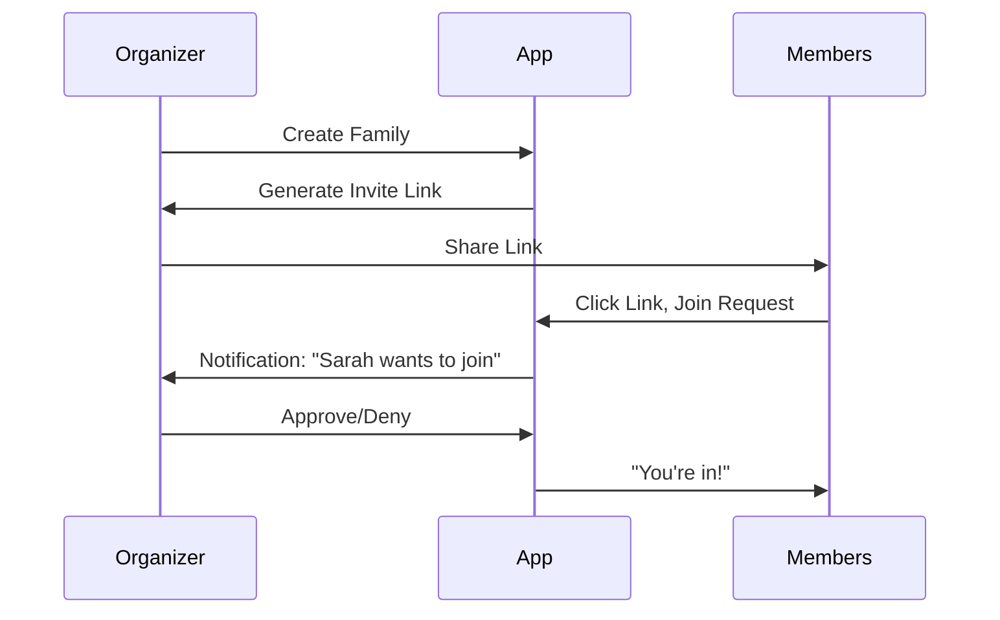

# PRD — v2 (Future Vision)

> **Version**: 2.0 (Planning Phase)
> **Status**: Not Started
> **Last Updated**: January 29, 2026

## Table of Contents

- [Overview](#overview)
- [Strategic Vision](#strategic-vision)
- [Target Users (Expanded)](#target-users-expanded)
- [Core v2 Features](#core-v2-features)
- [User Stories](#user-stories)
- [Technical Requirements](#technical-requirements)
- [Migration from v1](#migration-from-v1)
- [Non-Goals](#non-goals)
- [Success Metrics](#success-metrics)
- [Open Questions](#open-questions)

---

## Overview

v2 transforms HoH Finance Tracker from a **single-user offline app** into a **shared financial system** for families and co-owners, enhanced with **AI-powered insights**. The core philosophy remains: **manual, intentional tracking**, but now with collaborative features and intelligent pattern recognition.

**Key Additions**:
- Family & multi-user support (up to 6 members)
- Role-based access control (RBAC)
- AI-powered spending insights
- Cloud sync (optional)
- Transaction editing & audit trails
- Recurring transaction templates

---

## Strategic Vision

### The v2 Problem

v1 solves personal finance tracking, but users face new challenges:
1. **Families**: Parents want to teach kids financial habits
2. **Co-owners**: Roommates, business partners, Airbnb co-hosts need shared visibility
3. **Pattern Blindness**: Users don't notice recurring overspending
4. **Data Growth**: As transaction history grows, manual analysis becomes tedious

### Our v2 Solution

HoH becomes the **family financial companion**:
- **Collaborative Tracking**: Multiple users, one source of truth
- **Intelligent Insights**: AI spots patterns humans miss
- **Privacy Controls**: Granular permissions (inspired by 1Password)
- **Still Offline-Capable**: Core features work without internet

### Differentiation

| Feature | Mint/YNAB | HoH v2 |
|---------|-----------|--------|
| Bank Sync | Required | Optional |
| Multi-user | No | Yes (family-focused) |
| Privacy | Cloud-only | Offline-first + optional sync |
| AI Insights | Generic | Context-aware, family-aware |
| Setup Time | 20+ min | < 2 min (no account linking) |

---

## Target Users (Expanded)

### New Persona: The Family Organizer

**Demographics**:
- Age: 35-50
- Parent with 1-3 kids (ages 8-18)
- Wants to teach financial responsibility

**Jobs-to-be-Done**:
1. "I want my kids to log their spending so they learn money awareness"
2. "I want to see family-wide spending without prying into personal transactions"
3. "I want to control who sees what (e.g., kids don't see mortgage)"
4. "I want to track shared expenses (groceries) separate from personal"

**Pain Points with Current Apps**:
- Mint/YNAB don't support multi-user families
- Shared bank accounts mix personal and family expenses
- No kid-friendly financial education tools

---

### New Persona: The Co-Owner

**Demographics**:
- Age: 25-40
- Shares financial responsibility:
  - Roommates splitting rent/utilities
  - Airbnb co-hosts tracking income/expenses
  - Small business partners

**Jobs-to-be-Done**:
1. "I want to see what my co-owner spent on shared expenses"
2. "I want to split bills fairly based on actual spending"
3. "I want transparency without full access to personal finances"

**Pain Points**:
- Venmo/Splitwise are transaction-by-transaction, not holistic
- Shared Excel sheets are error-prone
- Trust but verify: Need visibility without invasion

---

## Core v2 Features

### 1. Family & Multi-User Support

#### 1.1 Family Creation Flow



**Details**:
- **No email required** (lowering barrier)
- **Invite link expires** after 7 days or 6 members (whichever first)
- **Organizer approval** required for all joins
- **Maximum 6 members** per family (v2 limit)
- **Member usernames** only (like gaming - fun, low friction)

#### 1.2 Family Structure

```
Family: "Smith Household"
├── Organizer: John (full access)
├── Co-organizer: Jane (full access, can't remove John)
├── Member: Sarah (age 16, limited access)
├── Member: Tommy (age 12, view-only)
└── Member: Emma (age 10, view-only)
```

**Roles**:
| Role | Permissions |
|------|-------------|
| **Organizer** | Full control, create/edit/delete everything, manage members |
| **Co-organizer** | Full access except can't remove organizer |
| **Member (Adult)** | Configurable by organizer (default: full access to own data) |
| **Member (Teen)** | Configurable by organizer (default: can log, can't edit budget) |
| **Member (Child)** | Configurable by organizer (default: view-only) |

---

### 2. Role-Based Access Control (RBAC)

**Inspiration**: 1Password's vault permissions

#### 2.1 Account-Level Permissions

Organizer controls per-member:
- **Which accounts visible**: "Sarah can see family checking, not parents' investment account"
- **Which transactions visible**: "Tommy can see his allowance transactions only"
- **Edit capabilities**: "Sarah can add transactions, but can't delete"

#### 2.2 Permission Matrix

| Feature | Organizer | Co-organizer | Adult Member | Teen | Child |
|---------|-----------|--------------|--------------|------|-------|
| Add Transaction | ✅ | ✅ | ✅ | ✅ | ❌ |
| Edit Own Transaction | ✅ | ✅ | ✅ | ⚠️ (with approval) | ❌ |
| Delete Transaction | ✅ | ✅ | ❌ | ❌ | ❌ |
| View All Accounts | ✅ | ✅ | 🔒 (configurable) | 🔒 | 🔒 |
| Set Budget | ✅ | ✅ | ❌ | ❌ | ❌ |
| Invite Members | ✅ | ✅ | ❌ | ❌ | ❌ |
| Modify Permissions | ✅ | ⚠️ (except organizer) | ❌ | ❌ | ❌ |

**Legend**:
- ✅ Always allowed
- ❌ Never allowed
- 🔒 Configurable by organizer
- ⚠️ Limited or requires approval

---

### 3. Family vs. Personal Views

Each user sees **two dashboard modes**:

#### 3.1 Personal Dashboard

- **My Spending**: Only transactions I logged or are assigned to me
- **My Accounts**: Accounts I have permission to see
- **My Budget**: Personal budget (if set)

#### 3.2 Family Dashboard

- **Family Spending**: Aggregated spending from all members
- **Shared Accounts**: Family checking, savings, credit cards
- **Family Budget**: Household budget set by organizer
- **Member Breakdown**: Who spent what (respecting permissions)

**Toggle**: Quick switch between Personal | Family view (Segmented control at top)

**Example**:
```
┌────────────────────────────────────────┐
│  [Personal] [Family]  ← Toggle         │
├────────────────────────────────────────┤
│  Family Spending: $4,200 / $5,000      │
│                                        │
│  By Member:                            │
│  ● John:   $1,800  (43%)               │
│  ● Jane:   $1,400  (33%)               │
│  ● Sarah:    $600  (14%)               │
│  ● Tommy:    $400  (10%)               │
└────────────────────────────────────────┘
```

---

### 4. AI-Powered Insights

**Requires**: User opt-in, data sent to secure cloud for processing

#### 4.1 Fixed Cost Detection

**Problem**: Users don't realize how much goes to recurring bills

**AI Solution**:
- Detects recurring transactions:
  - Same merchant, similar amount, regular interval
- Categorizes as "Fixed Costs":
  - Rent/Mortgage
  - Utilities
  - Subscriptions (Netflix, Spotify, etc.)
- **Monthly Report**:
  ```
  Fixed Costs: $2,200 (73% of spending)
  Variable Costs: $800 (27% of spending)

  Suggestion: Focus on reducing variable costs
  ```

**Privacy**: All analysis on-device OR user explicitly enables cloud AI

#### 4.2 Spending Insights

**Examples**:
- "Coffee spending up 60% this month ($240 vs. $150 average)"
- "You always overspend on weekends (average $120/day vs. $40 weekday)"
- "Entertainment spending spikes every Friday (movie night?)"

**UI**: Insight cards on dashboard (dismissible)

#### 4.3 Budget Recommendations

**Problem**: Users don't know what's a realistic budget

**AI Solution**:
- Analyzes 3 months of spending
- Suggests budget per category:
  ```
  Recommended Monthly Budget

  Food & Dining:    $800 (based on your avg $780)
  Transport:        $200 (based on your avg $185)
  Shopping:         $300 (based on your avg $320)
  Entertainment:    $150 (based on your avg $145)

  Total: $1,450/month
  ```

**User Control**: Accept all, customize, or ignore

---

### 5. Cloud Sync (Optional)

**Philosophy**: Offline-first remains, sync is opt-in

#### 5.1 Sync Strategy

- **Conflict Resolution**: Last-write-wins with timestamp
- **Selective Sync**: User can choose:
  - Sync everything
  - Sync only family data
  - Sync only backups (no real-time)

#### 5.2 Sync Architecture

```
┌─────────────┐         ┌─────────────┐
│   Device A  │  ←───→  │   Cloud     │
│  (Local DB) │         │  (Postgres) │
└─────────────┘         └─────────────┘
                              ↕
                        ┌─────────────┐
                        │   Device B  │
                        │  (Local DB) │
                        └─────────────┘
```

**When to Sync**:
- On app open (if online)
- On transaction add (if online)
- Manual "Sync Now" button

**Offline Resilience**:
- All features work offline
- Sync queue holds changes until online
- No data loss if offline for weeks

---

### 6. Transaction Editing & Audit Trails

**Why Now**: Users need to fix mistakes, family needs accountability

#### 6.1 Edit Capabilities

**Who Can Edit**:
- Organizer: Any transaction
- Co-organizer: Any transaction
- Adult Member: Own transactions
- Teen: Own transactions (with organizer approval in settings)
- Child: Cannot edit

**What Can Be Edited**:
- Amount
- Date
- Account
- Category
- Merchant/Item
- Note

**What Cannot Be Edited**:
- Transaction ID
- Creator (who logged it)
- Created timestamp

#### 6.2 Audit Trail

Every edit creates audit log entry:

```typescript
{
  transaction_id: "abc-123",
  field_changed: "amount",
  old_value: "5000 cents",
  new_value: "5500 cents",
  changed_by: "user-john",
  changed_at: "2026-02-15T10:30:00Z",
  reason: "Corrected receipt error"
}
```

**UI**: Transaction detail view shows:
```
Transaction Details

Amount: $55.00
Date: Feb 15, 2026
...

History:
● Feb 15, 10:30 AM - John edited amount from $50.00 to $55.00
● Feb 15, 08:15 AM - John created transaction
```

**Privacy**: Audit logs respect permissions (kids don't see parent edits)

---

### 7. Recurring Transactions

**User Request**: "I pay rent on the 1st every month"

#### 7.1 Create Recurring Template

**UI**:
```
┌────────────────────────────────────────┐
│  Create Recurring Transaction          │
├────────────────────────────────────────┤
│  Item:        Rent                     │
│  Amount:      $1,500                   │
│  Account:     Checking                 │
│  Category:    Housing                  │
│  Frequency:   [Monthly ▼]              │
│  On Day:      [1 ▼] of the month       │
│  Start Date:  Feb 1, 2026              │
│  End Date:    [Never ▼]                │
│                                        │
│  [Create Template]                     │
└────────────────────────────────────────┘
```

**Frequency Options**:
- Daily
- Weekly (on specific day)
- Bi-weekly
- Monthly (on specific date)
- Yearly

#### 7.2 Auto-Create Behavior

**Strategy**: Create transactions 1 day before due date (not weeks in advance)

**Notification**:
```
Reminder: Rent of $1,500 is due tomorrow
[Log Now] [Skip This Month] [Edit]
```

**User Control**:
- Can skip individual occurrence
- Can edit occurrence (creates one-off, doesn't change template)
- Can delete template (stops future occurrences)

---

## User Stories

### Must Have (v2)

| ID | Story | Acceptance Criteria |
|----|-------|---------------------|
| US-020 | As an organizer, I want to create a family group | - Create family with unique name<br>- Generate invite link<br>- Link expires after 7 days |
| US-021 | As a member, I want to join a family via invite link | - Click link → Opens app<br>- Request to join<br>- Organizer approves → I'm in |
| US-022 | As an organizer, I want to control what each member sees | - Per-member account visibility settings<br>- Per-member edit capabilities<br>- Changes apply immediately |
| US-023 | As a user, I want to see personal vs. family spending | - Toggle between Personal and Family dashboard<br>- Family dashboard shows aggregated spending<br>- Personal dashboard shows only my transactions |
| US-024 | As a user, I want to edit past transactions | - Tap transaction → Edit mode<br>- Modify fields → Save<br>- Audit log records change |
| US-025 | As a user, I want to set up recurring transactions | - Create template with frequency<br>- App auto-creates transactions<br>- Can skip or edit individual occurrences |

### Should Have (v2)

| ID | Story | Acceptance Criteria |
|----|-------|---------------------|
| US-026 | As a user, I want AI insights on spending patterns | - Opt-in to AI insights<br>- See insight cards on dashboard<br>- Insights are actionable (not generic) |
| US-027 | As a user, I want cloud sync across devices | - Opt-in to sync<br>- Changes on device A appear on device B<br>- Offline changes sync when online |
| US-028 | As a parent, I want to see what my kids spend on | - Family dashboard shows breakdown by member<br>- Can tap member → See their transactions<br>- Respects privacy settings |

---

## Technical Requirements

### Cloud Infrastructure

**Backend**:
- Node.js + Express (or similar)
- PostgreSQL (production)
- Redis (sync queue)

**Authentication**:
- JWT tokens
- Refresh token rotation
- Device fingerprinting

**Sync Protocol**:
- REST API for CRUD
- WebSocket for real-time updates (optional)
- Conflict resolution: Last-write-wins with vector clocks

### AI Processing

**Options**:
1. **On-Device ML** (privacy-first):
   - CoreML (iOS), TensorFlow Lite (Android)
   - Pros: No data leaves device
   - Cons: Limited model complexity
2. **Cloud ML** (more powerful):
   - OpenAI API or custom models
   - Pros: Advanced insights
   - Cons: Requires user opt-in, data privacy concerns

**Recommendation**: Hybrid
- Simple insights (fixed cost detection) on-device
- Advanced insights (predictive) in cloud (opt-in)

### Database Schema Changes

**New Tables**:
- `families` (id, name, created_at, created_by)
- `family_members` (family_id, user_id, role, permissions_json)
- `audit_logs` (transaction_id, field, old_value, new_value, changed_by, changed_at)
- `recurring_templates` (id, user_id, item, amount, frequency, next_occurrence)

**Migration Strategy**:
- v1 users: Prompt to create "personal family" (1 member)
- Existing transactions: Assign to user

---

## Migration from v1

### Data Migration

**Step 1**: User updates to v2
**Step 2**: App runs migration:
- Creates "Personal" family with user as organizer
- Assigns all existing transactions to user
- Keeps all v1 data intact

**Step 3**: User can invite family members (optional)

### Feature Flags

Gradual rollout:
- Phase 1: Family features (no AI, no sync)
- Phase 2: AI insights (beta)
- Phase 3: Cloud sync (beta)
- Phase 4: Full release

---

## Non-Goals

What v2 **will NOT** include:

| Feature | Reason | Future Version |
|---------|--------|----------------|
| Bank sync | v1 principle: manual tracking | v3+ (if user demand) |
| Tax categorization | Requires CPA-level expertise | v3+ |
| Investment portfolio tracking | Too complex for v2 | v3+ |
| Cryptocurrency tracking | Volatile, complex | v3+ |
| Business expense reports | B2B out of scope | Never (different market) |

---

## Success Metrics

### v2-Specific Metrics

| Metric | Target | Measurement |
|--------|--------|-------------|
| **Family Adoption** | 30% of users create family | % users with > 1 member |
| **Member Engagement** | 60% of family members log transactions | Active members / total members |
| **AI Insight Click-Through** | 40% tap insight cards | Taps / impressions |
| **Sync Adoption** | 50% enable sync | % users with sync on |
| **Edit Usage** | 20% edit at least one transaction | % users who edit |
| **Recurring Template Creation** | 40% create at least one template | % users with templates |

### v1 Metrics (Continued)

| Metric | v1 Target | v2 Target | Rationale |
|--------|-----------|-----------|-----------|
| 7-Day Retention | 40% | 50% | Family features increase stickiness |
| Transaction Entry Time | < 30 sec | < 25 sec | Recurring templates save time |
| Daily Active Users | TBD | 2x v1 | Multi-user increases frequency |

---

## Open Questions

### Privacy & Security

1. **GDPR Compliance**: If syncing to cloud, how do we handle:
   - Right to data deletion?
   - Data portability (export)?
   - Consent for minors (if kids use app)?

2. **End-to-End Encryption**: Should transaction data be E2EE in cloud?
   - Pro: Maximum privacy
   - Con: Can't run AI on encrypted data

### Product

1. **Family Size Limit**: Is 6 members enough?
   - 1Password allows up to 5, we're doing 6
   - Larger families exist (7+ kids), but rare

2. **Pricing Model**: v2 requires cloud costs
   - Option A: Freemium (basic free, AI + sync paid)
   - Option B: Free with ads (family product + ads = bad UX?)
   - Option C: Paid tiers ($5/month for family, $2/month solo)

3. **Inter-Family Transfers**: If two families both use app, can they send money?
   - Example: Parent sends kid off to college, different "family"
   - Complexity: High
   - Leaning: No (use external transfer methods)

---

## Timeline (Tentative)

| Phase | Features | Duration | Target Date |
|-------|----------|----------|-------------|
| **Planning** | PRD finalization, design | 1 month | Feb 2026 |
| **v2.0 Alpha** | Family + RBAC only | 2 months | Apr 2026 |
| **v2.0 Beta** | + Transaction editing + Recurring | 2 months | Jun 2026 |
| **v2.1 Beta** | + AI insights (on-device) | 1 month | Jul 2026 |
| **v2.2 Beta** | + Cloud sync | 2 months | Sep 2026 |
| **v2.0 Public** | Full release | - | Oct 2026 |

**Total**: ~8 months from v1 release to v2 public

---

## Related Documentation

- **v1 PRD**: `v1.en.md` (this document builds on v1)
- **Architecture**: `02_architecture/system-overview.md` (updated for v2)
- **Security**: `02_architecture/security.md` (RBAC, sync security)

---

**Status**: This PRD is in **planning phase**. Expect significant changes as we finalize design and user research.

**Next Steps**:
1. User research: Interview families about pain points
2. Design mockups: Family dashboard, permission settings
3. Technical spike: Sync protocol proof-of-concept
4. Cost analysis: Cloud infrastructure requirements
