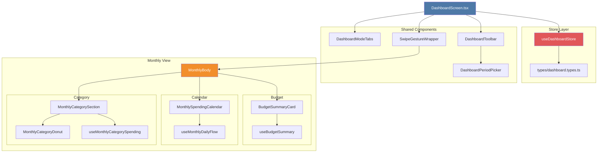

# Dashboard Folder Structure Refactoring

> Last updated: January 23, 2026

## Overview

The dashboard feature underwent a major architectural refactoring to improve code organization, scalability, and maintainability. This migration transformed the dashboard from a flat component structure with `useReducer` state management to a domain-driven, folder-based architecture powered by Zustand.

**Why this matters:** As the dashboard grows to support Year and All-time views, the new structure makes it easier to add features, test components, and maintain code quality. The refactoring doesn't change any user-facing functionality but sets a solid foundation for future development.

## What Changed

### Before vs. After Structure

**Before (Flat Structure):**
```
dashboard/
├── DashboardScreen.tsx
├── dashboard.model.ts       # Types + utilities
├── dashboard.state.ts       # useReducer logic
├── dashboard.styles.ts
└── components/
    ├── DashboardModeTabs.tsx
    ├── DashboardPeriodNav.tsx
    ├── DashboardPeriodPicker.tsx
    ├── DashboardScopeSegment.tsx
    ├── SwipeGestureWrapper.tsx
    └── monthly/
        ├── MonthlyBody.tsx
        ├── monthly.utils.ts
        ├── BudgetSummaryCard.tsx
        ├── useDashboardBudget.ts
        ├── MonthlySpendingCalendar.tsx
        ├── useMonthlyDailyFlow.ts
        ├── MonthlyCategorySection.tsx
        ├── MonthlyCategoryDonut.tsx
        ├── useMonthlyCategorySpending.ts
        └── monthlyCategory.utils.ts
```

**After (Domain-Driven Structure):**
```
dashboard/
├── DashboardScreen.tsx
├── index.ts                 # Public API
├── store/
│   ├── dashboard.store.ts   # Zustand store
│   ├── dashboard.styles.ts
│   └── index.ts
├── types/
│   ├── dashboard.types.ts   # Type definitions + utilities
│   └── index.ts
├── hooks/
│   ├── useDashboardMonthlyData.ts
│   └── index.ts
├── shared/
│   ├── DashboardModeTabs.tsx
│   ├── DashboardToolbar.tsx
│   ├── DashboardPeriodPicker.tsx
│   ├── ScopeChips.tsx
│   ├── SwipeGestureWrapper.tsx
│   └── index.ts
└── monthly/
    ├── MonthlyBody.tsx
    ├── monthly.utils.ts
    ├── index.ts
    ├── budget/
    │   ├── BudgetSummaryCard.tsx
    │   ├── useBudgetSummary.ts
    │   └── index.ts
    ├── calendar/
    │   ├── MonthlySpendingCalendar.tsx
    │   ├── useMonthlyDailyFlow.ts
    │   └── index.ts
    └── category/
        ├── MonthlyCategorySection.tsx
        ├── MonthlyCategoryDonut.tsx
        ├── useMonthlyCategorySpending.ts
        ├── category.utils.ts
        └── index.ts
```

## Key Architectural Changes

### 1. Zustand Store Migration

**Old Pattern (useReducer):**
```typescript
// dashboard.state.ts
type DashboardAction =
  | { type: 'SET_MODE'; payload: DashboardMode }
  | { type: 'SET_SCOPE'; payload: Scope }
  | { type: 'SHIFT_PERIOD'; payload: -1 | 1 }
  | { type: 'SET_PERIOD'; payload: Period }
  | { type: 'RESET_TO_TODAY' }

function dashboardReducer(state: DashboardState, action: DashboardAction): DashboardState {
  switch (action.type) {
    case 'SET_MODE':
      return { ...state, mode: action.payload }
    // ... more cases
  }
}

// DashboardScreen.tsx
const [state, dispatch] = useReducer(dashboardReducer, undefined, createInitialDashboardState)
dispatch({ type: 'SET_MODE', payload: 'overview' })
```

**New Pattern (Zustand):**
```typescript
// store/dashboard.store.ts
export const useDashboardStore = create<DashboardStore>()((set, get) => ({
  // State
  mode: 'overview',
  scope: 'month',
  period: { year: 2026, month: 1 },

  // Actions
  setMode: (mode) => set({ mode }),
  setScope: (scope) => {
    const state = get()
    const normalized = normalizeForScope(scope, state.period)
    const clamped = clampToMax(scope, normalized)
    set({ scope, period: clamped })
  },
  shiftPeriod: (delta) => {
    const state = get()
    const shifted = shift(state.scope, state.period, delta)
    set({ period: clampToMax(state.scope, shifted) })
  },

  // Selectors
  getPeriodLabel: () => {
    const state = get()
    return formatPeriodLabel(state.scope, state.period)
  },
  canPrev: () => get().scope !== 'all',
  canNext: () => {
    const state = get()
    const max = getMaxYearMonth()
    if (state.scope === 'all') return false
    if (state.scope === 'year') return state.period.year < max.year
    const month = 'month' in state.period ? state.period.month : 1
    return ymIndex({ year: state.period.year, month }) < ymIndex(max)
  }
}))

// DashboardScreen.tsx
const { mode, setMode, period, shiftPeriod, canPrev, canNext } = useDashboardStore()
setMode('overview')
```

**Benefits:**
- Less boilerplate (no action types, no switch statements)
- Better TypeScript inference
- Built-in selectors for derived state
- Easier to test (can access store outside React)
- No need to pass dispatch through component tree

### 2. Type Extraction

All type definitions and utility functions moved from `dashboard.model.ts` to `types/dashboard.types.ts`:

```typescript
// types/dashboard.types.ts
export type DashboardMode = 'overview' | 'cashflow' | 'accounts' | 'networth'
export type Scope = 'month' | 'year' | 'all'
export type Period = { year: number; month: number } | { year: number }

export const MODES: ReadonlyArray<{ key: DashboardMode; label: string }> = [
  { key: 'overview', label: 'Overview' },
  { key: 'cashflow', label: 'Cash Flow' },
  { key: 'accounts', label: 'Accounts' },
  { key: 'networth', label: 'Net Worth' }
]

export function clampMonth(m: number): number { /* ... */ }
export function formatPeriodLabel(scope: Scope, period: Period): string { /* ... */ }
export function getMaxYearMonth(now = new Date()): { year: number; month: number } { /* ... */ }
// ... more utility functions
```

**Benefits:**
- Types and utilities are co-located
- Easier to import only what you need
- Clear separation between types and business logic

### 3. Domain-Based Organization

Components organized by responsibility:

**`shared/`** - Components used across multiple view modes:
- `DashboardModeTabs.tsx` - Overview/Cash Flow/Accounts/Net Worth tabs
- `DashboardToolbar.tsx` - Period navigation + scope selector (unified component)
- `DashboardPeriodPicker.tsx` - iOS scroll wheel picker
- `ScopeChips.tsx` - Month/Year/All chip selector
- `SwipeGestureWrapper.tsx` - Swipe gesture handler

**`monthly/`** - Monthly view-specific components:
- `budget/` - Budget summary card and logic
- `calendar/` - Daily cash flow calendar
- `category/` - Category spending breakdown

**Benefits:**
- Easier to find components
- Clear ownership boundaries
- Scales well as new views (Year, All-time) are added
- Related components stay together

### 4. Barrel Exports

Each folder has an `index.ts` that exports its public API:

```typescript
// shared/index.ts
export { DashboardModeTabs } from './DashboardModeTabs'
export { DashboardToolbar } from './DashboardToolbar'
export { DashboardPeriodPicker } from './DashboardPeriodPicker'
export { ScopeChips } from './ScopeChips'
export { SwipeGestureWrapper } from './SwipeGestureWrapper'

// monthly/category/index.ts
export { MonthlyCategorySection } from './MonthlyCategorySection'
export { MonthlyCategoryDonut } from './MonthlyCategoryDonut'
export { useMonthlyCategorySpending } from './useMonthlyCategorySpending'
```

**Benefits:**
- Clean imports in parent components
- Easy to refactor internal file names
- Clear public API boundary

### 5. Component Consolidation

**Merged components:**
- `DashboardPeriodNav.tsx` + `DashboardScopeSegment.tsx` → `DashboardToolbar.tsx`

**Renamed for clarity:**
- `useDashboardBudget.ts` → `useBudgetSummary.ts` (better semantic meaning)
- `monthlyCategory.utils.ts` → `category.utils.ts` (follows naming pattern)

**Why consolidate?**
- The period navigation and scope selector were always used together
- Single unified toolbar reduces prop drilling
- Follows Apple Calendar's single-row toolbar design

### 6. Styles Separation

To improve maintainability and follow React Native best practices, we extracted inline styles from shared components into dedicated style files.

**Pattern Applied:**

Each style file follows a consistent factory pattern:

```typescript
// Component.styles.ts
import { StyleSheet } from 'react-native'
import { useHoHTheme } from '@/providers/HoHThemeProvider'

export function createComponentStyles(theme: ReturnType<typeof useHoHTheme>) {
  return StyleSheet.create({
    container: {
      backgroundColor: theme.background.val,
      // ... more styles
    },
    // ... more style objects
  })
}

export type ComponentStyles = ReturnType<typeof createComponentStyles>
```

```typescript
// Component.tsx
import { useMemo } from 'react'
import { useHoHTheme } from '@/providers/HoHThemeProvider'
import { createComponentStyles } from './Component.styles'

export function Component() {
  const theme = useHoHTheme()
  const styles = useMemo(() => createComponentStyles(theme), [theme])

  return <View style={styles.container}>...</View>
}
```

**Components Refactored:**

| Component | Style File Created | Location |
|-----------|-------------------|----------|
| `ScopeChips.tsx` | `ScopeChips.styles.ts` | `shared/` |
| `DashboardToolbar.tsx` | `DashboardToolbar.styles.ts` | `shared/` |
| `DashboardPeriodPicker.tsx` | `DashboardPeriodPicker.styles.ts` | `shared/` |

**Files Created:**
- `/Users/parkhuynh/0_nicole/projects/hoh/hoh_finance-tracker/src/features/dashboard/shared/ScopeChips.styles.ts`
- `/Users/parkhuynh/0_nicole/projects/hoh/hoh_finance-tracker/src/features/dashboard/shared/DashboardToolbar.styles.ts`
- `/Users/parkhuynh/0_nicole/projects/hoh/hoh_finance-tracker/src/features/dashboard/shared/DashboardPeriodPicker.styles.ts`

**Files Modified:**
- `/Users/parkhuynh/0_nicole/projects/hoh/hoh_finance-tracker/src/features/dashboard/shared/ScopeChips.tsx`
- `/Users/parkhuynh/0_nicole/projects/hoh/hoh_finance-tracker/src/features/dashboard/shared/DashboardToolbar.tsx`
- `/Users/parkhuynh/0_nicole/projects/hoh/hoh_finance-tracker/src/features/dashboard/shared/DashboardPeriodPicker.tsx`

**Benefits:**
- **Separation of Concerns:** Visual styling is separated from component logic
- **Performance:** `useMemo` prevents unnecessary style recalculation on re-renders
- **Type Safety:** Exported style types enable better TypeScript inference
- **Maintainability:** Easier to update styles without touching component logic
- **Consistency:** All shared components follow the same pattern

**Why Monthly Components Were Skipped:**

Monthly view components (`MonthlySpendingCalendar`, `MonthlyCategoryDonut`, etc.) use a different pattern with the `CalendarColors` prop interface:

```typescript
interface CalendarColors {
  positive: string
  negative: string
  zero: string
  // ...
}
```

This pattern is already clean because:
- Colors are injected as props rather than hardcoded
- Theme-dependent styling is handled at the parent level
- Components remain pure and testable
- No inline StyleSheet.create() calls

**Code Example - Before & After:**

```typescript
// Before: ScopeChips.tsx (inline styles)
export function ScopeChips({ value, onChange }: ScopeChipsProps) {
  const theme = useHoHTheme()

  return (
    <XStack gap="$2">
      {SCOPES.map((item) => (
        <View
          key={item.key}
          style={{
            paddingHorizontal: 12,
            paddingVertical: 6,
            borderRadius: 16,
            backgroundColor: item.key === value
              ? theme.blue.val
              : theme.gray2.val
          }}
        >
          {/* ... */}
        </View>
      ))}
    </XStack>
  )
}

// After: ScopeChips.tsx (extracted styles)
export function ScopeChips({ value, onChange }: ScopeChipsProps) {
  const theme = useHoHTheme()
  const styles = useMemo(() => createScopeChipsStyles(theme), [theme])

  return (
    <XStack gap="$2">
      {SCOPES.map((item) => (
        <View
          key={item.key}
          style={[
            styles.chip,
            item.key === value ? styles.chipActive : styles.chipInactive
          ]}
        >
          {/* ... */}
        </View>
      ))}
    </XStack>
  )
}

// ScopeChips.styles.ts (new file)
export function createScopeChipsStyles(theme: ReturnType<typeof useHoHTheme>) {
  return StyleSheet.create({
    chip: {
      paddingHorizontal: 12,
      paddingVertical: 6,
      borderRadius: 16,
    },
    chipActive: {
      backgroundColor: theme.blue.val,
    },
    chipInactive: {
      backgroundColor: theme.gray2.val,
    },
  })
}
```

## Visual Architecture



## Files Modified

| File | Status | Description |
|------|--------|-------------|
| `DashboardScreen.tsx` | Modified | Updated to use Zustand store instead of useReducer |
| `dashboard.model.ts` | Deleted | Moved to `types/dashboard.types.ts` |
| `dashboard.state.ts` | Deleted | Migrated to `store/dashboard.store.ts` |
| `dashboard.styles.ts` | Moved | Now in `store/dashboard.styles.ts` |
| `components/DashboardPeriodNav.tsx` | Deleted | Merged into `shared/DashboardToolbar.tsx` |
| `components/DashboardScopeSegment.tsx` | Deleted | Merged into `shared/DashboardToolbar.tsx` |
| `components/DashboardToolbar.tsx` | Created | New unified toolbar component |
| `components/ScopeChips.tsx` | Created | Extracted from DashboardScopeSegment |
| `components/monthly/useDashboardBudget.ts` | Renamed | Now `monthly/budget/useBudgetSummary.ts` |
| `components/monthly/monthlyCategory.utils.ts` | Renamed | Now `monthly/category/category.utils.ts` |
| `shared/ScopeChips.styles.ts` | Created | Extracted styles from ScopeChips component |
| `shared/DashboardToolbar.styles.ts` | Created | Extracted styles from DashboardToolbar component |
| `shared/DashboardPeriodPicker.styles.ts` | Created | Extracted styles from DashboardPeriodPicker component |
| `shared/ScopeChips.tsx` | Modified | Now uses external style file |
| `shared/DashboardToolbar.tsx` | Modified | Now uses external style file |
| `shared/DashboardPeriodPicker.tsx` | Modified | Now uses external style file |
| All component files | Moved | Reorganized into `shared/` and domain folders |
| `index.ts` files | Created | Barrel exports for each folder |

## Migration Checklist

This refactoring was completed with the following steps:

- [x] Create new folder structure (`store/`, `types/`, `hooks/`, `shared/`, `monthly/`)
- [x] Move `dashboard.model.ts` → `types/dashboard.types.ts`
- [x] Convert `dashboard.state.ts` → `store/dashboard.store.ts` (Zustand)
- [x] Move `dashboard.styles.ts` → `store/dashboard.styles.ts`
- [x] Merge `DashboardPeriodNav` + `DashboardScopeSegment` → `DashboardToolbar`
- [x] Extract `ScopeChips` component
- [x] Organize shared components into `shared/` folder
- [x] Group monthly components into subfolders (`budget/`, `calendar/`, `category/`)
- [x] Rename `useDashboardBudget` → `useBudgetSummary`
- [x] Rename `monthlyCategory.utils` → `category.utils`
- [x] Create barrel exports (`index.ts`) for all folders
- [x] Update `DashboardScreen.tsx` to use new imports and Zustand store
- [x] Update all component imports to use barrel exports
- [x] Extract styles from shared components (`ScopeChips`, `DashboardToolbar`, `DashboardPeriodPicker`)
- [x] Create style files using factory pattern with `useMemo` optimization
- [x] Update components to use external style files
- [x] Test functionality (period navigation, scope switching, monthly view)
- [x] Verify no user-facing changes

## Testing Notes

**Verified functionality:**
- Period navigation (previous/next chevrons)
- Scope switching (Month/Year/All chips)
- Period picker (iOS scroll wheels)
- Swipe gestures (left/right navigation)
- Monthly view rendering (budget, calendar, category breakdown)
- "Today" button quick navigation

**No regressions detected:** All existing features work identically to before the refactor.

## Future Considerations

This new structure makes it easy to add:

1. **Year and All-time views:**
   - Create `yearly/` and `alltime/` folders alongside `monthly/`
   - Each folder contains its own components and hooks
   - Shared components stay in `shared/`

2. **Additional hooks:**
   - Add to `hooks/` folder for cross-view logic
   - Keep view-specific hooks in their domain folders

3. **Testing:**
   - Store can be tested independently
   - Components are more isolated and easier to test
   - Mock stores easily with Zustand's testing utilities

4. **Code splitting:**
   - Barrel exports make it easy to implement lazy loading
   - Each view can be code-split independently

## Developer Notes

**Import patterns to follow:**

```typescript
// Good - Use barrel exports
import { DashboardToolbar } from './shared'
import { MonthlyBody } from './monthly'
import { useBudgetSummary } from './monthly/budget'

// Avoid - Direct file imports
import { DashboardToolbar } from './shared/DashboardToolbar'
```

**Adding new components:**

1. Identify the domain (shared, monthly, yearly, etc.)
2. Create the component file in the appropriate folder
3. Add export to the folder's `index.ts`
4. Import using barrel export in parent component

**Store usage:**

```typescript
// Use selectors for derived state
const canGoNext = useDashboardStore((s) => s.canNext())

// Use actions for mutations
const setMode = useDashboardStore((s) => s.setMode)

// Or destructure for multiple values
const { mode, period, setMode, shiftPeriod } = useDashboardStore()
```

## Related Documentation

- [Dashboard Feature Documentation](./dashboard.md) - Comprehensive feature overview
- [PRD v1](./v1.md) - Product requirements for v1 MVP

---

This refactoring lays the groundwork for a scalable, maintainable dashboard that can grow to support multiple view modes while keeping code organized and testable.
