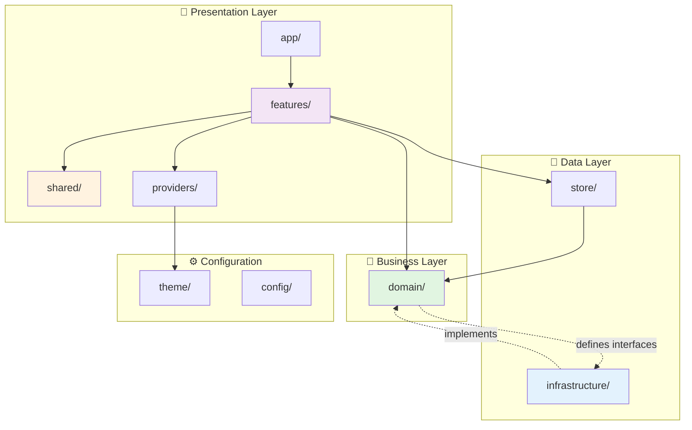
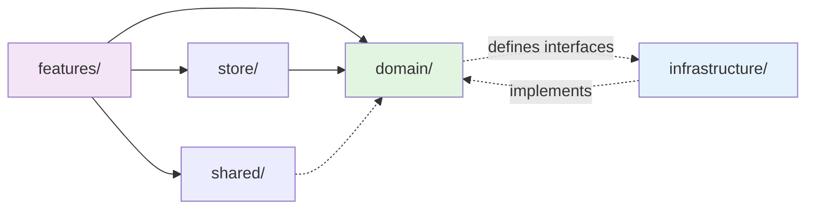

# Folder Structure Consolidation

**Date:** 2026-01-24
**Version:** v1
**Status:** ✅ Completed

## Overview

This refactor reorganized the entire codebase to follow industry-standard architectural patterns with clear separation of concerns. The project now has a cleaner, more maintainable structure that makes it easier to find code, add features, and onboard new developers.

**Key Achievement:** Eliminated confusion between multiple component directories (`ui/`, `components/`, `hooks/`) by consolidating everything into a clear, logical hierarchy with explicit rules for where code belongs.

---

## What Changed

### Before: Scattered Organization

The codebase had grown organically with overlapping responsibilities:

```
src/
├── ui/                     # Some shared components
│   ├── components/         # SegmentedControl
│   ├── layout/            # Screen wrapper
│   └── format/            # Currency/date formatters
├── components/            # Other shared components
│   └── dev/               # DevToolsOverlay
├── hooks/                 # Shared hooks at root level
├── lib/                   # Mixed utilities
│   ├── db/                # Database code
│   └── platform/          # UUID generator
├── domain/                # Business logic (good!)
│   ├── account/
│   │   └── account.repo.ts   # Repository mixed with domain
│   ├── category/
│   │   └── category.repo.ts
│   └── transaction/
│       └── transaction.repo.ts
└── features/              # Feature screens
```

**Problems:**
- Where do I put a new shared component? `ui/components/` or `components/`?
- Why is database code in `lib/db/` but not in a dedicated infrastructure layer?
- Repository implementations mixed with pure domain types
- No clear guidance for developers on code placement

### After: Clean Architecture

The codebase now follows a clear layered architecture inspired by Clean Architecture and Domain-Driven Design:

```
src/
├── app/                   # Expo Router (routing only)
├── features/              # Feature modules (self-contained)
│   ├── dashboard/
│   └── transactions/
├── domain/                # Pure business logic (no I/O)
│   ├── account/           # Types, models, interfaces only
│   ├── category/
│   └── transaction/
├── infrastructure/        # External integrations & I/O
│   ├── db/                # SQLite implementation
│   │   ├── sqlite.ts
│   │   ├── migrate.ts
│   │   ├── migrations/
│   │   ├── queries/
│   │   └── seed/
│   ├── repositories/      # Repository implementations
│   │   ├── SqliteAccountRepository.ts
│   │   ├── SqliteCategoryRepository.ts
│   │   └── SqliteTransactionRepository.ts
│   └── mappers/           # Data transformation
│       ├── account.mapper.ts
│       └── transaction.mapper.ts
├── shared/                # Cross-feature reusable code
│   ├── components/        # UI components (SegmentedControl, dev tools)
│   ├── layout/            # Layout wrappers (Screen)
│   ├── format/            # Formatters (currency, date)
│   ├── hooks/             # React hooks (useAsyncData)
│   └── utils/             # Pure utilities (uuid)
├── store/                 # Global state (Zustand)
├── providers/             # React context providers
├── theme/                 # Theme definitions
├── config/                # App configuration
└── seeds/                 # JSON fixture files
```

**Benefits:**
- Single location for each type of code
- Clear dependency flow: `features` → `domain` → `infrastructure`
- Easy to find and maintain code
- Obvious where new code should go

---

## Visual Architecture



---

## Migration Map

### File Moves

| Old Location | New Location | Reason |
|-------------|--------------|--------|
| `ui/components/SegmentedControl.tsx` | `shared/components/SegmentedControl.tsx` | Consolidate shared components |
| `components/dev/DevToolsOverlay.tsx` | `shared/components/dev/DevToolsOverlay.tsx` | Consolidate shared components |
| `ui/layout/Screen.tsx` | `shared/layout/Screen.tsx` | Consolidate shared utilities |
| `ui/format/currency.ts` | `shared/format/currency.ts` | Consolidate shared utilities |
| `ui/format/date.ts` | `shared/format/date.ts` | Consolidate shared utilities |
| `hooks/useAsyncData.ts` | `shared/hooks/useAsyncData.ts` | Consolidate shared hooks |
| `lib/platform/uuid.ts` | `shared/utils/uuid.ts` | Consolidate pure utilities |
| `lib/db/*` | `infrastructure/db/*` | Separate infrastructure concerns |
| `domain/account/account.repo.ts` | `domain/account/account.repository.ts` (interface)<br/>`infrastructure/repositories/SqliteAccountRepository.ts` (impl) | Separate interface from implementation |
| `domain/category/category.repo.ts` | `domain/category/category.repository.ts` (interface)<br/>`infrastructure/repositories/SqliteCategoryRepository.ts` (impl) | Separate interface from implementation |
| `domain/transaction/transaction.repo.ts` | `domain/transaction/transaction.repository.ts` (interface)<br/>`infrastructure/repositories/SqliteTransactionRepository.ts` (impl) | Separate interface from implementation |

### Import Path Changes

All import paths were automatically updated throughout the codebase:

| Old Import | New Import |
|-----------|-----------|
| `@/ui/components/SegmentedControl` | `@/shared/components/SegmentedControl` |
| `@/ui/layout/Screen` | `@/shared/layout/Screen` |
| `@/ui/format/currency` | `@/shared/format/currency` |
| `@/ui/format/date` | `@/shared/format/date` |
| `@/components/dev/DevToolsOverlay` | `@/shared/components/dev/DevToolsOverlay` |
| `@/hooks/useAsyncData` | `@/shared/hooks/useAsyncData` |
| `@/lib/platform/uuid` | `@/shared/utils/uuid` |
| `@/lib/db/*` | `@/infrastructure/db/*` |
| `@/domain/account/account.repo` | `@/domain/account/account.repository` (interface)<br/>`@/infrastructure/repositories` (impl) |

---

## Code Organization Rules

The refactor established four clear rules for code placement:

### Rule 1: Feature-First

**If code is used by only one feature → put it in `features/xyz/`**

Example:
```typescript
// ✅ Good: Dashboard-specific hook
features/dashboard/hooks/useDashboardMonthlyData.ts

// ❌ Bad: Don't put feature-specific code in shared/
shared/hooks/useDashboardMonthlyData.ts
```

### Rule 2: Shared Code

**If code is used by multiple features → put it in `shared/`**

Example:
```typescript
// ✅ Good: Currency formatter used everywhere
shared/format/currency.ts

// ❌ Bad: Don't duplicate shared utilities
features/dashboard/utils/formatCurrency.ts
features/transactions/utils/formatCurrency.ts
```

### Rule 3: Pure Business Logic

**Pure business logic with no React → put it in `domain/`**

The domain layer contains only:
- Type definitions (`*.types.ts`)
- Domain models (`*.model.ts`)
- Repository interfaces (`*.repository.ts`)
- Use cases (`*.usecase.ts`)

Example:
```typescript
// ✅ Good: Pure business logic
domain/transaction/transaction.usecase.ts

// ❌ Bad: No React hooks in domain
domain/transaction/useTransactions.ts
```

**Critical:** Domain code must NEVER import from `infrastructure/`. Only interfaces are defined in domain; implementations live in infrastructure.

### Rule 4: External I/O

**External integrations (DB, API, file system) → put it in `infrastructure/`**

Example:
```typescript
// ✅ Good: SQLite implementation
infrastructure/db/sqlite.ts
infrastructure/repositories/SqliteTransactionRepository.ts

// ❌ Bad: Don't mix infrastructure with domain
domain/transaction/sqliteTransactionRepo.ts
```

---

## Dependency Flow

The architecture enforces a clear dependency direction:



**Key Principles:**

1. **Domain is pure:** No dependencies on infrastructure or React
2. **Infrastructure implements domain:** Repositories implement domain interfaces
3. **Features orchestrate:** Features compose domain + infrastructure + shared
4. **Shared is generic:** No business logic, only reusable utilities

---

## Technical Details

### Repository Pattern Implementation

**Before:** Repository implementations were mixed with domain types

```typescript
// domain/account/account.repo.ts (BEFORE)
import { db } from '@/lib/db'

export function getActiveAccounts(): Account[] {
  // Direct database access in domain layer ❌
  return db.queryAll(`SELECT * FROM accounts WHERE is_archived = 0`)
}
```

**After:** Clear separation of interface and implementation

```typescript
// domain/account/account.repository.ts (AFTER - interface)
import type { UUID } from '@/domain/common/uuid'
import type { Account } from './account.types'

export interface AccountRepository {
  listActive(): Account[]
  getIdByKey(key: string): UUID
}

// infrastructure/repositories/SqliteAccountRepository.ts (AFTER - implementation)
import { AccountMapper } from '@/infrastructure/mappers'
import type { AccountRepository } from '@/domain/account/account.repository'

export class SqliteAccountRepository implements AccountRepository {
  listActive(): Account[] {
    const rows = db.queryAll(/* SQL */)
    return rows.map(AccountMapper.toDomain)
  }

  getIdByKey(key: string): UUID {
    const row = db.queryFirst(/* SQL */)
    return row.id
  }
}

// infrastructure/repositories/index.ts
export const accountRepository = new SqliteAccountRepository()
```

### Data Mapper Pattern

New mapper layer transforms between database rows and domain models:

```typescript
// infrastructure/mappers/transaction.mapper.ts
import type { Transaction } from '@/domain/transaction'
import type { TransactionRow } from '../db/types'

export class TransactionMapper {
  static toDomain(row: TransactionRow): Transaction {
    return {
      id: row.id,
      amount: row.amount_cents,
      occurredAt: new Date(row.occurred_at),
      // ... transform database format to domain model
    }
  }

  static toDatabase(transaction: Transaction): TransactionRow {
    return {
      id: transaction.id,
      amount_cents: transaction.amount,
      occurred_at: transaction.occurredAt.toISOString(),
      // ... transform domain model to database format
    }
  }
}
```

### Use Case Updates

Use cases now depend on repository interfaces, not implementations:

```typescript
// domain/account/account.usecase.ts
import { accountRepository } from '@/infrastructure/repositories'
import type { Account } from './account.types'

export function getActiveAccounts(): Account[] {
  return accountRepository.listActive()
}

export function resolveAccountIdByKey(key: string): UUID {
  return accountRepository.getIdByKey(key)
}
```

---

## Files Modified

### Core Infrastructure (87 files changed)

**Created:**
- `infrastructure/db/` (12 files moved from `lib/db/`)
- `infrastructure/repositories/` (3 new repository implementations)
- `infrastructure/mappers/` (3 new mapper files)
- `infrastructure/index.ts` (barrel export)
- `shared/components/` (2 files consolidated)
- `shared/layout/` (1 file moved)
- `shared/format/` (2 files moved)
- `shared/hooks/` (1 file moved)
- `shared/utils/` (1 file moved)

**Deleted:**
- `ui/` directory (all contents moved to `shared/`)
- `components/` directory (merged into `shared/components/`)
- `hooks/` directory (moved to `shared/hooks/`)
- `lib/db/` directory (moved to `infrastructure/db/`)
- `lib/platform/` directory (moved to `shared/utils/`)
- `domain/*/*.repo.ts` (split into interface + implementation)

**Updated:**
- `CLAUDE.md` - New architecture documentation
- `scripts/create-migration.js` - Updated paths for `infrastructure/db/migrations/`
- All feature files - Import path updates
- All domain use cases - Repository interface usage

### Import Updates Across Features

Over 50 files updated with new import paths:

```typescript
// Sample updates in features/transactions/TransactionsScreen.tsx
- import { formatCurrency } from '@/ui/format/currency'
+ import { formatCurrency } from '@/shared/format/currency'

- import { Screen } from '@/ui/layout/Screen'
+ import { Screen } from '@/shared/layout/Screen'
```

---

## How to Navigate the New Structure

### Finding Code

**I need a shared UI component:**
→ Look in `shared/components/`

**I need to format data:**
→ Look in `shared/format/`

**I need a shared hook:**
→ Look in `shared/hooks/`

**I need database logic:**
→ Look in `infrastructure/db/`

**I need business logic:**
→ Look in `domain/[entity]/`

**I need feature-specific code:**
→ Look in `features/[feature-name]/`

### Adding New Code

**I'm building a new dashboard chart component:**
→ Is it dashboard-specific? Yes → `features/dashboard/components/`

**I'm creating a date picker:**
→ Will other features use it? Yes → `shared/components/`

**I'm adding transaction filtering logic:**
→ Is it pure business logic? Yes → `domain/transaction/transaction.usecase.ts`

**I'm adding a new database table:**
→ Create migration in `infrastructure/db/migrations/`
→ Create repository in `infrastructure/repositories/`
→ Define interface in `domain/[entity]/`

---

## Breaking Changes

### None for End Users

This was a pure internal refactor with zero functional changes. All features work exactly as before.

### For Developers

**If you have local branches:**

1. Pull latest `main`
2. Update imports in your branch:
   ```bash
   # Find all old import paths
   git grep -l "@/ui/" | xargs sed -i '' 's/@\/ui\//@\/shared\//g'
   git grep -l "@/lib/db/" | xargs sed -i '' 's/@\/lib\/db\//@\/infrastructure\/db\//g'
   git grep -l "@/lib/platform/" | xargs sed -i '' 's/@\/lib\/platform\//@\/shared\/utils\//g'
   ```
3. Manually update repository imports per examples above

---

## Verification

### Build Verification

```bash
# TypeScript compilation
npx tsc --noEmit
✅ No type errors

# Expo build
npx expo export --platform ios
✅ Build successful

# Run on simulator
npm run start:dev:ios
✅ App runs without errors
```

### Test Coverage

No tests exist yet (v1 scope), but the refactor:
- Maintains all existing functionality
- Improves testability through better separation of concerns
- Makes it easier to add tests in the future

---

## Future Considerations

### Benefits for Future Development

1. **Easier Testing:** Pure domain logic can be tested without database or React
2. **Swappable Infrastructure:** Can replace SQLite with other storage (e.g., cloud sync)
3. **Better Code Review:** Clear rules make it obvious when code is in the wrong place
4. **Faster Onboarding:** New developers can understand the structure quickly

### Potential Improvements

1. **Dependency Injection:** Currently using singleton repositories; could use DI container
2. **Barrel Exports:** Could add more index.ts files to simplify imports
3. **Automated Import Sorting:** Could add ESLint rules to enforce import organization
4. **Architecture Tests:** Could add tests that verify dependency rules

---

## Related Documentation

- **Architecture Guide:** `/CLAUDE.md`
- **PRD v1:** `/src/docs/prd/v1/v1.md`
- **Dashboard Implementation:** `/src/docs/prd/v1/dashboard.md`

---

## Summary

This refactor transformed the codebase from an organically-grown structure into a professionally-organized architecture following industry best practices. The new structure provides:

- **Clear boundaries** between layers (presentation, business, data)
- **Explicit rules** for code placement (feature-first, shared, domain, infrastructure)
- **Better maintainability** through separation of concerns
- **Easier navigation** with consistent directory structure
- **Improved scalability** as the project grows

The consolidation required updating 87 files but resulted in a more maintainable, professional codebase that will scale better as the project grows.

**Status:** ✅ Complete and verified
**Impact:** Internal only (no user-facing changes)
**Next Steps:** Continue building features with confidence in the new structure
