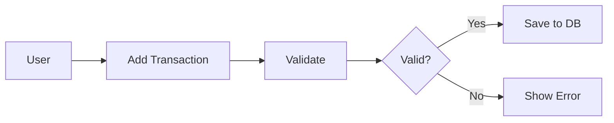

# HoH Finance Tracker Documentation

> **Welcome**: This is the centralized documentation hub for HoH Finance Tracker. Everything you need to understand, build, and contribute to the project is here.

---

## Quick Start

### I'm new here, where do I start?

**Role**:
- 👔 **Product/Business**: Start with [Project Overview](00_overview/README.md) → [PRD v1](01_prd/v1.en.md)
- 💻 **Developer**: Start with [Project Overview](00_overview/README.md) → [CLAUDE.md](../../CLAUDE.md) → [ADR-0002](03_decisions/adr-0002-clean-architecture-adoption.md)
- 🎨 **Designer**: Start with [Project Overview](00_overview/README.md) → [PRD v1](01_prd/v1.en.md) → [Design System](04_design/design-system.md) (placeholder)
- 🚀 **Stakeholder**: Start with [Project Overview](00_overview/README.md) → [Changelog](05_delivery/changelog.md)

---

## Documentation Structure

```
📁 new/
│
├── 📄 README.md                     # ← You are here
│
├── 📂 00_overview/                  # Project Introduction
│   ├── README.md                    # One-page project overview
│   ├── principles.md                # Design & architectural principles
│   └── glossary.md                  # Term definitions
│
├── 📂 01_prd/                       # Product Requirements
│   ├── v1.en.md                     # v1 PRD (English)
│   ├── v2.en.md                     # v2 PRD (English)
│   └── open-questions.md            # Unresolved questions & ideas
│
├── 📂 02_architecture/              # Technical Architecture
│   ├── system-overview.md           # High-level architecture (C4 model)
│   ├── data-model.md                # Database schema & relationships
│   ├── api-contracts.md             # API design (future v2)
│   ├── security.md                  # Security model & threat analysis
│   ├── observability.md             # Logging, metrics, tracing
│   └── performance.md               # Performance considerations
│
├── 📂 03_decisions/                 # Architecture Decision Records (ADRs)
│   ├── adr-0001-repo-doc-strategy.md
│   ├── adr-0002-clean-architecture-adoption.md
│   └── adr-0003-sync-offline-strategy.md
│
├── 📂 04_design/                    # Design System & UX
│   ├── design-system.md             # Typography, spacing, layout
│   ├── tokens.md                    # Color, font, spacing tokens
│   ├── charts.md                    # Chart design rules
│   ├── accessibility.md             # A11y guidelines
│   ├── components.md                # Component usage (Do/Don't)
│   └── ux-flows/                    # Key user flows
│       ├── add-transaction.md
│       └── onboarding.md
│
├── 📂 05_delivery/                  # Release Management
│   ├── changelog.md                 # Version history (Keep a Changelog)
│   ├── rollout-plan.md              # Deployment strategy
│   └── release-notes/               # User-facing release notes
│       └── 2026-02-02-v0.1.0.md
│
└── 📂 06_runbooks/                  # Operational Guides
    ├── pull_request_template.md     # PR checklist
    └── ISSUE_TEMPLATE/              # GitHub issue templates
        ├── bug.md
        ├── feature.md
        └── decision.md
```

---

## Documentation Types Explained

### 1. Overview (00_overview/)

**Purpose**: High-level project introduction for new stakeholders

**Contents**:
- README: One-page project summary
- Principles: Core design and architectural principles
- Glossary: Definitions of project-specific terms

**When to Read**: First day on project

---

### 2. Product Requirements (01_prd/)

**Purpose**: Define **what** we're building and **why**

**Contents**:
- v1.en.md: MVP requirements (current development)
- v2.en.md: Future vision (family features, AI)
- open-questions.md: Unresolved decisions, ideas backlog

**Key Characteristics**:
- **Living Documents**: Updated as implementation evolves
- **User-Focused**: Written from user's perspective
- **Version-Specific**: Each version has its own PRD

**When to Update**:
- Feature scope changes
- User stories added/removed
- Success metrics defined

---

### 3. Architecture (02_architecture/)

**Purpose**: Define **how** the system is built technically

**Contents**:
- system-overview.md: Component diagram, high-level architecture
- data-model.md: Database schema, entity relationships
- api-contracts.md: API endpoints, request/response formats
- security.md: Authentication, authorization, encryption
- observability.md: Logging, metrics, monitoring
- performance.md: Query optimization, caching, indexing

**Key Characteristics**:
- **Living Documents**: Reflect current state of system
- **Technical**: Written for engineers
- **Diagrams**: Heavy use of visual aids (C4, ERD, sequence diagrams)

**When to Update**:
- Major refactoring (create ADR too)
- Schema changes
- API endpoints added/modified

---

### 4. Decisions (03_decisions/)

**Purpose**: Record **architectural decisions** with rationale

**Format**: ADR (Architecture Decision Record)

**Key Characteristics**:
- **Immutable**: Never edit an ADR, only supersede with new one
- **Structured**: Context → Decision → Alternatives → Consequences
- **Traceable**: Links to PRs, issues, commits

**When to Create**:
- Major architectural change (e.g., adopting Repository Pattern)
- Technology choice (e.g., Zustand vs. Redux)
- Breaking pattern decisions (e.g., violating Clean Architecture rule)

**Template**:
```markdown
# ADR-XXXX: Title

**Date**: YYYY-MM-DD
**Status**: ✅ Accepted | ⏳ Proposed | ❌ Superseded

## Context
Why this decision was needed

## Decision
What we decided (1-3 sentences)

## Alternatives Considered
Options we evaluated (with pros/cons)

## Consequences
Positive, negative, risks, mitigation

## Related
Links to PRs, issues, ADRs
```

---

### 5. Design (04_design/)

**Purpose**: Define **visual and UX standards**

**Contents**:
- design-system.md: Typography, spacing, layout principles
- tokens.md: Theme tokens (colors, fonts, spacing values)
- charts.md: Data visualization rules
- accessibility.md: A11y guidelines (contrast, focus, screen readers)
- components.md: Component usage with Do/Don't examples
- ux-flows/: User flows with screenshots + state diagrams

**Key Characteristics**:
- **Prescriptive**: Do this, don't do that
- **Visual**: Screenshots, Figma embeds, before/after
- **Consistent**: Ensures design coherence across features

**When to Update**:
- New components added
- Design tokens changed
- UX pattern established

---

### 6. Delivery (05_delivery/)

**Purpose**: Track **releases and deployment**

**Contents**:
- changelog.md: Version history (developer-facing)
- rollout-plan.md: Deployment strategy, feature flags
- release-notes/: User-facing release announcements

**Key Characteristics**:
- **Chronological**: Ordered by release date
- **Two Audiences**: Changelog (devs), Release Notes (users)
- **Standardized**: Keep a Changelog format

**When to Update**:
- Every PR merged (add to Unreleased section)
- Version tagged (move Unreleased to new version)
- Public release (create user-facing release note)

---

### 7. Runbooks (06_runbooks/)

**Purpose**: **Operational guides** and templates

**Contents**:
- PR template: Checklist for pull requests
- Issue templates: Bug, feature, decision templates

**Key Characteristics**:
- **Actionable**: Step-by-step instructions
- **Standardized**: Enforces consistent processes

**When to Update**:
- New PR requirement added (e.g., must link ADR)
- New issue type (e.g., security vulnerability template)

---

## Documentation Principles

### 1. Write for the Reader

**Bad**:
> "We use the Repository Pattern with dependency inversion."

**Good**:
> "The Repository Pattern lets us swap SQLite for cloud storage in v2 without changing business logic. [Link to ADR-0002]"

**Why**: Context > jargon

---

### 2. Keep It Fresh

**Rule**: Documentation older than 3 months without updates is probably stale.

**How**:
- Review docs quarterly
- Update on every major change
- Mark outdated sections with ⚠️

---

### 3. Show, Don't Just Tell

Use:
- ✅ Mermaid diagrams
- ✅ Tables
- ✅ Code examples
- ✅ Before/after comparisons

**Example**:


---

### 4. Link Liberally

**Good Documentation is Connected**:
- PRD references ADRs
- ADRs link to PRs
- Changelog points to ADRs
- Architecture diagrams link to code

**Why**: Discoverability

---

### 5. Version Everything

**File Naming**:
- ✅ PRDs: `v1.en.md`, `v2.en.md`
- ✅ ADRs: `adr-0002-clean-architecture.md`
- ✅ Dated Docs: `2026-01-29_migration-summary.md`

**Why**: Clear what's current vs. historical

---

## How to Contribute

### For Product/Business

**Adding Features**:
1. Propose in `/01_prd/open-questions.md`
2. Discuss with team
3. Add to relevant PRD (v1 or v2)
4. Create user stories with acceptance criteria

**Changing Scope**:
1. Update PRD
2. Note in changelog (under "Changed")
3. Communicate to team

---

### For Developers

**Making Architectural Changes**:
1. Create ADR (propose decision)
2. Get team buy-in
3. Implement
4. Update ADR status to "Accepted"
5. Update architecture docs (system-overview, data-model, etc.)
6. Add to changelog

**Adding Features**:
1. Read relevant PRD section
2. Check for related ADRs
3. Implement
4. Update changelog (add to "Unreleased")
5. If new pattern, update CLAUDE.md

**Refactoring**:
1. If architectural change → Create ADR
2. If minor cleanup → Just changelog
3. Update architecture docs if structure changes

---

### For Designers

**New Components**:
1. Document in `/04_design/components.md`
2. Add to design system
3. Update tokens if new colors/spacing
4. Add to Figma (if applicable)

**New UX Flows**:
1. Create flow doc in `/04_design/ux-flows/`
2. Include screenshots + state diagram
3. Link from relevant PRD

---

## FAQ

### Q: Should I update PRD or Architecture first?

**A**: PRD first (what), then architecture (how).

PRD defines requirements → Architecture documents implementation.

---

### Q: When do I create an ADR?

**A**: If you're asking "why did we do it this way?" 6 months from now, create an ADR.

**Examples**:
- ✅ "Why Zustand over Redux?" → ADR
- ✅ "Why Repository Pattern?" → ADR
- ❌ "Why this component is blue?" → Design doc, not ADR
- ❌ "Why this variable name?" → Code comment, not ADR

---

### Q: How do I supersede an ADR?

**A**:
1. Create new ADR (e.g., ADR-0005 supersedes ADR-0002)
2. Update old ADR status: `Status: ❌ Superseded by ADR-0005`
3. New ADR references old: `Supersedes: ADR-0002`

**Never delete or edit old ADRs** (they're historical records).

---

### Q: What goes in changelog vs. release notes?

**Changelog** (developer-facing):
- Added: New database table
- Changed: Refactored TransactionRepository
- Fixed: Null pointer in account mapper

**Release Notes** (user-facing):
- New: Edit past transactions
- Improved: Faster category loading
- Fixed: Budget not updating correctly

---

### Q: Do we need Korean translation for everything?

**A**: Priority order:
1. PRDs (high user-facing value)
2. Design docs (for Korean designers)
3. ADRs (lower priority, mostly English technical terms)
4. Architecture (English is fine)

---

## Maintenance Schedule

| Task | Frequency | Owner |
|------|-----------|-------|
| Review PRDs for staleness | Quarterly | Product |
| Update architecture diagrams | After major refactoring | Tech Lead |
| Review ADRs for missing links | Monthly | Team |
| Update changelog | Every PR merge | Developer |
| Refresh glossary | Quarterly | Team |

---

## Tools & Resources

### Writing Tools

- **Markdown Editor**: VS Code with Markdown Preview Enhanced
- **Diagrams**: [Mermaid Live Editor](https://mermaid.live/)
- **Spell Check**: Grammarly or VS Code spell checker
- **Link Checker**: TBD (need to add CI check)

### Templates

All templates are in `/src/docs/templates/` (TBD - to be created)

### External Resources

- [Keep a Changelog](https://keepachangelog.com/)
- [ADR Template](https://github.com/joelparkerhenderson/architecture-decision-record)
- [C4 Model](https://c4model.com/)
- [Mermaid Docs](https://mermaid.js.org/)

---

## Status Overview

| Section | Status | Completion |
|---------|--------|------------|
| Overview | ✅ Complete | 100% |
| PRDs | ✅ Complete | 100% (English) |
| Architecture | ⏳ Placeholder | 0% (structure ready) |
| ADRs | 🚧 In Progress | 33% (1/3 complete) |
| Design | ⏳ Placeholder | 0% (structure ready) |
| Delivery | ✅ Complete | 100% |
| Runbooks | ⏳ Placeholder | 0% (structure ready) |

**Overall**: ~40% complete (high-priority sections done)

---

## Contact & Feedback

**Documentation Owner**: TBD
**Last Updated**: January 29, 2026
**Next Review**: End of v1 beta (February 2026)

**Feedback**: Open an issue with label `documentation` or discuss in team sync

---

## Changelog for This Documentation

| Date | Change | Author |
|------|--------|--------|
| 2026-01-29 | Initial migration from legacy docs | Claude |
| TBD | Added Korean translations for PRDs | TBD |
| TBD | Filled architecture section | TBD |

---

**Happy Documenting!** 🎉
