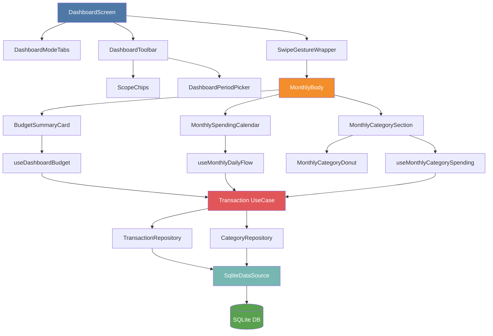

# Dashboard Feature Documentation

> Last updated: January 23, 2026

## Table of Contents

- [Overview](#overview)
- [Recent Changes](#recent-changes)
  - [January 2026 - Infrastructure Refactoring](#january-2026---infrastructure-refactoring)
- [Implementation Status](#implementation-status)
  - [Core Features](#core-features)
  - [Monthly View](#monthly-view)
  - [Data Layer](#data-layer)
  - [Pending Features](#pending-features)
- [User Interface](#user-interface)
  - [Toolbar Design](#toolbar-design)
  - [Period Picker](#period-picker)
  - [Swipe Gestures](#swipe-gestures)
- [File Structure](#file-structure)
- [State Management](#state-management)
  - [State Shape](#state-shape)
  - [Actions](#actions)
  - [Selectors](#selectors)
- [Key Components](#key-components)
  - [DashboardToolbar](#dashboardtoolbar)
  - [DashboardPeriodPicker](#dashboardperiodpicker)
  - [SwipeGestureWrapper](#swipegesturewrapper)
- [Utility Functions](#utility-functions)
- [Dependencies](#dependencies)
- [Design Decisions](#design-decisions)
  - [Why unified toolbar?](#why-unified-toolbar)
  - [Why iOS scroll wheels?](#why-ios-scroll-wheels)
  - [Why swipe gestures?](#why-swipe-gestures)
- [Monthly View Implementation](#monthly-view-implementation)
  - [1. Budget Summary Card](#1-budget-summary-card)
  - [2. Daily Cash Flow Calendar](#2-daily-cash-flow-calendar)
  - [3. Category Spending Breakdown](#3-category-spending-breakdown)
- [Data Architecture](#data-architecture)
  - [Repository Pattern](#repository-pattern)
  - [Key Use Cases](#key-use-cases)
  - [Infrastructure Layer](#infrastructure-layer)
  - [Custom Hook Pattern](#custom-hook-pattern)
- [Visual Design Philosophy](#visual-design-philosophy)
  - [Inspiration](#inspiration)
  - [Color System](#color-system)
  - [Typography Hierarchy](#typography-hierarchy)
- [Performance Optimizations](#performance-optimizations)
  - [Data Fetching](#data-fetching)
  - [Rendering](#rendering)
  - [Database](#database)
- [Future Considerations](#future-considerations)
- [Architecture Diagram](#architecture-diagram)
- [Quick Reference](#quick-reference)
  - [File Locations](#file-locations)
  - [Key Commands](#key-commands)
  - [Configuration](#configuration)

---

## Overview

The Dashboard is the primary screen of the HoH Finance Tracker app. It provides users with financial insights across different time periods (month, year, or all time) and multiple view modes (Overview, Cash Flow, Accounts, Net Worth).

**Current Status:** Monthly view is fully implemented with budget tracking, daily cash flow calendar, and category spending breakdown. Year and All-time views are planned for future releases.

---

## Recent Changes

### January 2026 - Infrastructure Refactoring

A major architectural refactoring was completed to improve code organization and maintainability:

**Repository Pattern Implementation:**
- Introduced `src/infrastructure/` layer with concrete repository implementations
- Migrated from direct `.repo.ts` files to interface-based repositories
- Files affected:
  - `transaction.repo.ts` → `SqliteTransactionRepository.ts`
  - `category.repo.ts` → `SqliteCategoryRepository.ts`
  - `account.repo.ts` → `SqliteAccountRepository.ts`

**Benefits:**
- **Testability**: Repository interfaces can be mocked for testing
- **Flexibility**: Easy to swap SQLite for a different data source
- **Type Safety**: Stronger type guarantees through explicit interfaces
- **Separation of Concerns**: Domain logic separated from data access

**Data Mappers:**
- Created `src/infrastructure/mappers/` for row-to-model conversion
- Handles type coercion and null safety in one place
- Maps database rows to domain models consistently

**DataSource Layer:**
- Added `SqliteDataSource.ts` to centralize database connection handling
- Provides type-safe query execution methods
- Manages connection lifecycle

**Migration Path:**
```
Before:  Component → UseCase → Repo (direct SQLite)
After:   Component → UseCase → Repository Interface → SqliteRepository → DataSource
```

This refactoring doesn't change any user-facing features but significantly improves the codebase structure for future development.

---

## Implementation Status

### Core Features

| Feature | Status | Notes |
|---------|--------|-------|
| Period Navigation | Complete | Chevron arrows + period label |
| Period Picker | Complete | iOS native scroll wheels |
| Swipe Gestures | Complete | Left/right navigation |
| Scope Selector | Complete | Month / Year / All chips |
| Mode Tabs | Complete | Overview / Cash Flow / Accounts / Net Worth |
| State Management | Complete | useReducer with actions |

### Monthly View

| Component | Status | Details |
|-----------|--------|---------|
| Budget Summary Card | Complete | Progress bar, spent vs. budget, crossing date |
| Daily Cash Flow Calendar | Complete | 7-day grid, transaction counts, toggle expense/income |
| Category Donut Chart | Complete | SVG-based, top 5 + Others |
| Category List | Complete | Color-coded rows with amounts and percentages |
| Empty States | Complete | "No spending yet" message |
| Loading States | Complete | Basic loading text (needs skeleton UI) |
| Error Handling | Complete | Error messages displayed |

### Data Layer

| Component | Status | Implementation |
|-----------|--------|----------------|
| Transaction Repository | Complete | SqliteTransactionRepository |
| Category Repository | Complete | SqliteCategoryRepository |
| Account Repository | Complete | SqliteAccountRepository |
| Data Mappers | Complete | transaction.mapper, account.mapper |
| Use Cases | Complete | getMonthlySummary, getDailyFlow, etc. |
| Custom Hooks | Complete | useDashboardBudget, useMonthlyDailyFlow, useMonthlyCategorySpending |

### Pending Features

| Feature | Status | Priority |
|---------|--------|----------|
| Year View | Not Started | High |
| All Time View | Not Started | High |
| Category Drilldown | Not Started | Medium |
| Period Comparison | Not Started | Medium |
| Budget per Category | Not Started | Low |
| Haptic Feedback | Not Started | Low |

---

## User Interface

### Toolbar Design

The toolbar follows a **single-row layout** inspired by Apple Calendar:

```
┌──────────────────────────────────────────────────────────────┐
│  ‹  January 2026  ›          [Today]  [Month] [Year] [All]  │
└──────────────────────────────────────────────────────────────┘
```

**Left Section: Period Navigation**
- Chevron arrows (`‹` `›`) for prev/next navigation
- Tappable period label that opens the period picker
- Disabled state when at boundaries (can't go to future)

**Right Section: Actions**
- **Today chip**: Quick return to current period (hidden when already viewing current)
- **Scope chips**: Toggle between Month | Year | All views

### Period Picker

iOS-native scroll wheel picker (~240px height):

```
┌─────────────────────────────────────────┐
│         ━━━━━━ (drag handle)            │
│                                         │
│      ┌──────────┬──────────────┐        │
│      │   2024   │   November   │        │
│      │   2025   │   December   │        │
│   ══>│══ 2026 ══│══ January ══│<══      │
│      │   2027   │   February   │        │
│      │   2028   │   March      │        │
│      └──────────┴──────────────┘        │
│                                         │
│              [ Done ]                   │
└─────────────────────────────────────────┘
```

- Year wheel on left, Month wheel on right
- Bottom sheet presentation with themed styling
- Future months are disabled
- Uses `@react-native-picker/picker` for native iOS feel

### Swipe Gestures

Users can swipe on the dashboard body to navigate periods:
- **Swipe left** → Next period (e.g., January → February)
- **Swipe right** → Previous period (e.g., January → December of previous year)
- Respects boundaries (can't swipe to future months)
- Disabled when scope is "All"

---

## File Structure

```
src/features/dashboard/
├── DashboardScreen.tsx          # Main screen component
├── dashboard.model.ts           # Types, constants, utilities
├── dashboard.state.ts           # Reducer and state management
├── dashboard.styles.ts          # Shared styles
└── components/
    ├── index.ts                 # Component exports
    ├── DashboardModeTabs.tsx    # Mode selector (Overview, Cash Flow, etc.)
    ├── DashboardToolbar.tsx     # Unified period nav + scope selector
    ├── DashboardPeriodPicker.tsx # iOS scroll wheel picker
    ├── ScopeChips.tsx           # Month | Year | All toggle
    ├── SwipeGestureWrapper.tsx  # Gesture handler for swipe navigation
    └── monthly/                 # Monthly view components
        ├── MonthlyBody.tsx      # Main monthly view container
        ├── monthly.utils.ts     # Date utilities (daysInMonth, etc.)
        ├── budget/
        │   ├── BudgetSummaryCard.tsx     # Budget progress card
        │   ├── useDashboardBudget.ts     # Budget data hook
        │   └── index.ts
        ├── calendar/
        │   ├── MonthlySpendingCalendar.tsx  # Daily cash flow grid
        │   └── useMonthlyDailyFlow.ts       # Daily data hook
        └── category/
            ├── MonthlyCategorySection.tsx     # Category breakdown UI
            ├── MonthlyCategoryDonut.tsx       # SVG donut chart
            ├── useMonthlyCategorySpending.ts  # Category data hook
            └── monthlyCategory.utils.ts       # Color/slice logic
```

---

## State Management

Uses React's `useReducer` pattern for predictable state updates.

### State Shape

```typescript
type DashboardState = {
  mode: 'overview' | 'cashflow' | 'accounts' | 'networth'
  scope: 'month' | 'year' | 'all'
  period: { year: number; month?: number }
}
```

### Actions

| Action | Description |
|--------|-------------|
| `SET_MODE` | Change dashboard view mode |
| `SET_SCOPE` | Change time scope (month/year/all) |
| `SHIFT_PERIOD` | Move to next (-1) or previous (+1) period |
| `SET_PERIOD` | Set specific period (from picker) |
| `RESET_TO_TODAY` | Jump to current month/year |

### Selectors

- `selectCanPrev(state)` → Can navigate to previous period?
- `selectCanNext(state)` → Can navigate to next period? (respects current date boundary)

---

## Key Components

### DashboardToolbar

Unified toolbar replacing the old separate scope segment and period navigation.

**Props:**
```typescript
{
  scope: Scope
  period: Period
  canPrev: boolean
  canNext: boolean
  onPrev: () => void
  onNext: () => void
  onOpenPicker: () => void
  onScopeChange: (scope: Scope) => void
  onToday: () => void
}
```

### DashboardPeriodPicker

Bottom sheet with iOS native picker wheels.

**Props:**
```typescript
{
  visible: boolean
  scope: Scope
  currentPeriod: Period
  onClose: () => void
  onSelect: (period: Period) => void
}
```

### SwipeGestureWrapper

Wraps content to enable horizontal swipe gestures.

**Props:**
```typescript
{
  children: ReactNode
  onSwipeLeft: () => void   // Next period
  onSwipeRight: () => void  // Previous period
  canSwipeLeft: boolean
  canSwipeRight: boolean
  enabled?: boolean
}
```

---

## Utility Functions

Located in `dashboard.model.ts`:

| Function | Description |
|----------|-------------|
| `getMonthNameShort(month)` | Returns "Jan", "Feb", etc. |
| `getMonthNameFull(month)` | Returns "January", "February", etc. |
| `formatPeriodLabelFull(scope, period)` | Returns "January 2026" or "2026" or "All time" |
| `isCurrentPeriod(scope, period)` | Checks if viewing current month/year |
| `getMaxYearMonth()` | Returns current year and month |
| `ymIndex({ year, month })` | Converts to numeric index for comparison |

---

## Dependencies

| Package | Purpose |
|---------|---------|
| `@react-native-picker/picker` | Native iOS scroll wheel picker |
| `react-native-gesture-handler` | Swipe gesture detection |
| `react-native-reanimated` | Smooth swipe animations |

**Note:** `GestureHandlerRootView` must wrap the app root (configured in `src/app/_layout.tsx`).

---

## Design Decisions

### Why unified toolbar?
- Reduces visual clutter (was 2 rows, now 1)
- Period is the **focal point** - what users care most about
- "Today" button provides quick escape hatch
- Follows patterns from Apple Calendar

### Why iOS scroll wheels?
- Native feel on iOS
- Very compact (~240px vs 400px+ for grid)
- Familiar interaction pattern
- Prevents invalid selections (future dates disabled)

### Why swipe gestures?
- Natural mobile interaction
- Faster than tapping arrows repeatedly
- Common pattern in calendar/finance apps

---

## Monthly View Implementation

The Monthly view is the primary dashboard experience, showing three main sections in a scrollable layout.

### 1. Budget Summary Card

**Visual Design:**
```
┌─────────────────────────────────────────┐
│ BUDGET SUMMARY                          │
│                                         │
│ $2.4K / $3.0K              80%         │
│ ━━━━━━━━━━━━━━━━━━━━━━━━━━━━━━━━━━━   │
│                                         │
│ Spent    Budget          $600 left     │
│                                         │
│ ⚠ Budget crossed on Jan 24             │
└─────────────────────────────────────────┘
```

**Features:**
- Shows spent vs. budget with large, readable numbers
- Progress bar with color coding (green when under budget, red when over)
- Displays remaining amount or amount over budget
- Tracks and displays the exact date when budget was first crossed
- Data sourced from `useDashboardBudget` hook
- Budget amount configurable in `APP_CONFIG.budget.defaultMonthlyBudgetDollar`

**Implementation:**
- Component: `BudgetSummaryCard.tsx`
- Hook: `useDashboardBudget.ts`
- Fetches monthly summary and daily expenses in parallel
- Calculates cumulative spending by day to detect budget crossing date
- Formats large numbers intelligently ($1.5K, $2.4M)

### 2. Daily Cash Flow Calendar

**Visual Design:**
Google Calendar-inspired grid showing daily spending activity.

```
┌─────────────────────────────────────────┐
│        Daily Cash Flow                  │
│                                         │
│ Jan 2026      [Expense] [Income]       │
│                                         │
│ S  M  T  W  T  F  S                    │
│ ━━━━━━━━━━━━━━━━━━━━━━━━━━━━━━━━━━━   │
│          1  2  3  4  5                 │
│       ●2    3  2                       │
│    ($240)                              │
│                                         │
│  6  7  8  9  10 11 12                  │
│ ●5  3  2  1   4  2  6                 │
│($340)                                   │
└─────────────────────────────────────────┘
```

**Features:**
- 7-day week grid with proper first-day alignment
- Each cell shows:
  - Day number (highlighted if today)
  - Transaction count badge
  - Expense amount (red pill, conditional)
  - Income amount (green pill, conditional)
- Toggleable expense/income display
  - Default: Expense ON, Income OFF
  - At least one must remain active (UX guard)
- Tappable cells navigate to transaction list filtered by date
- 64px cell height for comfortable touch targets
- Respects theme colors for borders and backgrounds

**Implementation:**
- Component: `MonthlySpendingCalendar.tsx`
- Hook: `useMonthlyDailyFlow.ts`
- Utilities: `monthly.utils.ts` (date calculations)
- Navigates to `/transactions?focusDate=YYYY-MM-DD` on cell press

**Data Flow:**
```typescript
type DailyFlow = {
  day: string          // YYYY-MM-DD
  incomeDollar: number
  expenseDollar: number
  txCount: number
}
```

### 3. Category Spending Breakdown

**Visual Design:**
```
┌─────────────────────────────────────────┐
│ Monthly Spending by Category            │
│                                         │
│        ╭─────────╮                      │
│       ╱           ╲                     │
│      │             │                    │
│      │    $2.4K    │ (Donut chart)      │
│      │    Total    │                    │
│       ╲   Spent   ╱                     │
│        ╰─────────╯                      │
│                                         │
│ ● Food           $840      35%          │
│ ● Transport      $520      22%          │
│ ● Shopping       $360      15%          │
│ ● Entertainment  $280      12%          │
│ ● Bills          $240      10%          │
│ ● Others         $160       6%          │
└─────────────────────────────────────────┘
```

**Features:**
- **Donut Chart** (SVG-based):
  - Shows top 5 categories + "Others" aggregation
  - Color-coded slices with stable color assignment
  - Center label shows total spent
  - 180px diameter, 16px stroke width
  - Starts at 12 o'clock position
- **Category Rows**:
  - Color dot matching donut slice
  - Category name (truncated if long)
  - Dollar amount (right-aligned)
  - Percentage of total (right-aligned)
  - Tappable for future drilldown

**Implementation:**
- Components: `MonthlyCategorySection.tsx`, `MonthlyCategoryDonut.tsx`
- Hook: `useMonthlyCategorySpending.ts`
- Utilities: `monthlyCategory.utils.ts`
- Color palette: 10 distinct colors for category assignment
- Hash-based color selection ensures same category always gets same color

**Data Structure:**
```typescript
type CategorySlice = {
  reactKey: string      // Unique React key
  colorKey: string      // Stable color assignment key
  label: string         // Category display name
  totalDollar: number
  percent: number       // 0..1
  color: string         // Hex color
}
```

**Edge Cases Handled:**
- No spending: Shows "No spending yet" message
- Uncategorized transactions: Grouped as "Uncategorized"
- Subcategories: Displayed with subcategory name
- Small amounts: Aggregated into "Others" category

---

## Data Architecture

The dashboard uses a **Repository Pattern** with an infrastructure layer that abstracts data access.

### Repository Pattern

```
┌─────────────────────────────────────────────┐
│           UI Components (Hooks)             │
├─────────────────────────────────────────────┤
│           Use Case Layer                    │
│  (transaction.usecase.ts)                   │
├─────────────────────────────────────────────┤
│          Repository Interface               │
│  (transaction.repository.ts)                │
├─────────────────────────────────────────────┤
│        Concrete Implementation              │
│  (SqliteTransactionRepository.ts)           │
├─────────────────────────────────────────────┤
│           Data Source                       │
│  (SqliteDataSource.ts)                      │
└─────────────────────────────────────────────┘
```

### Key Use Cases

Located in `src/domain/transaction/transaction.usecase.ts`:

| Function | Purpose | Returns |
|----------|---------|---------|
| `getMonthlySummaryDollar(monthYYYYMM)` | Total income/expense for month | `{ incomeTotalDollar, expenseTotalDollar }` |
| `getDailyExpenseTotalsDollarForMonth(monthYYYYMM)` | Daily expense totals | `Array<{ day, totalDollar }>` |
| `getMonthlyExpenseByCategoryDollar(monthYYYYMM)` | Category breakdown | `Array<{ categoryId, totalDollar }>` |

### Infrastructure Layer

Located in `src/infrastructure/`:

**Repositories:**
- `SqliteTransactionRepository` - Transaction data access
- `SqliteCategoryRepository` - Category data access
- `SqliteAccountRepository` - Account data access

**Mappers:**
- Convert between database rows and domain models
- Handle type conversions and null safety
- Resolve category references from IDs

**Data Sources:**
- `SqliteDataSource` - Wraps expo-sqlite with type-safe queries
- Provides connection pooling and query execution

### Custom Hook Pattern

Dashboard uses custom hooks for data fetching with consistent patterns:

```typescript
function useDataHook(param: string) {
  const [loading, setLoading] = useState(false)
  const [error, setError] = useState<string | null>(null)
  const [data, setData] = useState<DataType | null>(null)

  useEffect(() => {
    let alive = true
    async function run() {
      setLoading(true)
      setError(null)
      try {
        const result = await fetchData(param)
        if (!alive) return
        setData(result)
      } catch (e) {
        if (!alive) return
        setError(e.message)
      } finally {
        if (alive) setLoading(false)
      }
    }
    run()
    return () => { alive = false }
  }, [param])

  return { loading, error, data }
}
```

**Benefits:**
- Automatic cleanup on unmount
- Loading states for all data
- Consistent error handling
- Re-fetch on parameter change

---

## Visual Design Philosophy

### Inspiration

The dashboard draws from modern finance and productivity apps:
- **Apple Calendar**: Grid layout, cell-based navigation
- **Google Calendar**: Clean borders, comfortable spacing
- **Mint/YNAB**: Budget progress bars, category visualization
- **iOS Design**: Native scroll pickers, smooth gestures

### Color System

Uses semantic theme colors for consistency:
- `primary` - Accent color (today indicator, active states)
- `success` - Income, under-budget (green tones)
- `danger` - Expenses, over-budget (red tones)
- `border` - Grid lines, card outlines
- `surface` - Card backgrounds
- `surfaceAlt` - Subtle backgrounds, progress tracks
- `text` - Primary text color

All colors adapt to light/dark mode via `HoHThemeProvider`.

### Typography Hierarchy

```
Section Titles:       15-17pt, weight 800, letter-spacing 0.2-0.3
Primary Values:       18-22pt, weight 900
Secondary Values:     12-15pt, weight 700
Labels:               12-13pt, weight 600-800
Cell Text:            11-12pt, weight 800
```

Bold weights (800-900) used throughout for clarity and modern aesthetic.

---

## Performance Optimizations

### Data Fetching

1. **Parallel Queries**: Budget card fetches summary + daily expenses simultaneously
2. **Memoization**: Date calculations and data maps use `useMemo`
3. **Cleanup**: All hooks properly cleanup on unmount to prevent memory leaks

### Rendering

1. **Stable Keys**: React keys use unique identifiers, not array indices
2. **Conditional Rendering**: Empty states handled gracefully
3. **Lazy Loading**: Only monthly view loads initially (year/all views TODO)

### Database

1. **Indexed Queries**: Transactions indexed by date for fast monthly lookups
2. **Repository Pattern**: Centralizes query logic, easy to optimize
3. **Type Safety**: Compile-time checks prevent query errors

---

## Future Considerations

**High Priority:**
- [ ] Implement Year and All-time body views
- [ ] Add period comparison mode (current vs. previous month/year)
- [ ] Category drilldown (tap category to see transactions)
- [ ] Budget per-category tracking

**Nice to Have:**
- [ ] Add haptic feedback on swipe completion
- [ ] Animate content transition when period changes
- [ ] Spending trends/predictions
- [ ] Export reports (PDF/CSV)
- [ ] Custom budget periods (weekly, quarterly)
- [ ] Multi-currency support in dashboard

**Technical Debt:**
- [ ] Abstract hook pattern into reusable `useAsyncData` utility
- [ ] Add loading skeletons instead of generic "Loading..." text
- [ ] Optimize SVG rendering for donut chart (consider react-native-svg optimizations)
- [ ] Add comprehensive error boundaries
- [ ] Implement data caching strategy to reduce redundant queries

---

## Architecture Diagram

The complete dashboard architecture showing component hierarchy and data flow:



**Legend:**
- Blue: Main screen component
- Orange: View components
- Red: Business logic layer
- Teal: Data access layer
- Green: Database

---

## Quick Reference

### File Locations

**Main Screen:**
- `/src/features/dashboard/DashboardScreen.tsx`

**Monthly View:**
- `/src/features/dashboard/components/monthly/MonthlyBody.tsx`
- `/src/features/dashboard/components/monthly/budget/BudgetSummaryCard.tsx`
- `/src/features/dashboard/components/monthly/calendar/MonthlySpendingCalendar.tsx`
- `/src/features/dashboard/components/monthly/category/MonthlyCategorySection.tsx`

**Infrastructure:**
- `/src/infrastructure/repositories/SqliteTransactionRepository.ts`
- `/src/infrastructure/repositories/SqliteCategoryRepository.ts`
- `/src/infrastructure/DataSource/SqliteDataSource.ts`

**Domain Layer:**
- `/src/domain/transaction/transaction.usecase.ts`
- `/src/domain/transaction/transaction.repository.ts` (interface)

### Key Commands

```bash
# Run on iOS with dev client (required for SQLite)
npm run start:dev:ios

# Create database migration
npm run db:migration:new monthly_summary_index

# Pull simulator database for inspection
npm run db:dev:pull
```

### Configuration

Budget amount set in `/src/config/app.config.ts`:
```typescript
export const APP_CONFIG = {
  budget: {
    defaultMonthlyBudgetDollar: 3000
  }
}
```

Category colors in `/src/features/dashboard/components/monthly/category/monthlyCategory.utils.ts`:
```typescript
colors: {
  palette: [
    '#4E79A7', '#F28E2B', '#E15759', '#76B7B2', '#59A14F',
    '#EDC948', '#B07AA1', '#FF9DA7', '#9C755F', '#BAB0AC'
  ]
}
```
